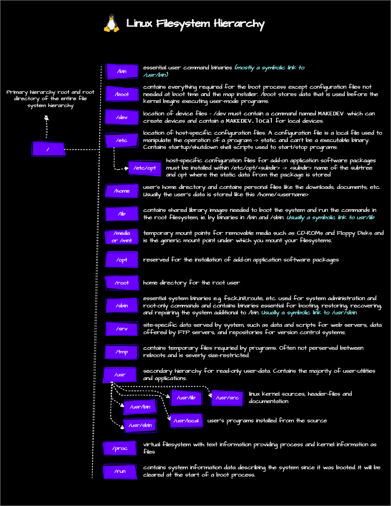

## Linux Filesystem

- **/** - root directory
- **/usr** - User programs
- **/var** - Variable files
  - e.g. /var/log - Log files 
- **/etc** - Text Based Configuration files
  - e.g. /etc/passwd - User account information
- **/bin** - Essential user command binaries
  - nowadays, /bin and /sbin are symbolic links to /usr/bin and /usr/sbin 
- **/boot** - Boot loader files
- **/dev** - Device files
  - e.g. /etc/sda -> primary hard drive/disk  
- **/home** - Home directories
- **/lib** & **/lib64** - Shared libraries
  - lib and lib64 are symbolic links to /usr/lib and /usr/lib64
- **/media** - Removable media
  - e.g. /media/cdrom - CD-ROM mount point
  - e.g. /media/usb - USB drive mount point
- **/mnt** - Mount point for mounting filesystems
- **/opt** - Add-on application software packages
- **/sbin** - Essential system command binaries
- **/srv** - Service data
- **/tmp** - Temporary files
- **/proc** - Kernel and process information
- **/root** - Root user home directory
  - need to do `sudo su` to chnage user and access root user home directory
- **/sys** - Kernel and system information
- **/usr/local** - Local hierarchy for locally installed software
### man hier 
- `man hier` will display the filesystem hierarchy standard.

### Also read here: 
- [Linux Filesystem Hierarchy - GeekForGeeks](https://www.bing.com/ck/a?!&&p=0c65e252701d9436JmltdHM9MTcyMzU5MzYwMCZpZ3VpZD0wYmJhZDhlZi1kNzkwLTZjYWEtMmFlNS1jYzM1ZDY4ZTZkM2QmaW5zaWQ9NTUyNA&ptn=3&ver=2&hsh=3&fclid=0bbad8ef-d790-6caa-2ae5-cc35d68e6d3d&psq=Linux+Fi%c3%b6le+system+hiereachy&u=a1aHR0cHM6Ly93d3cuZ2Vla3Nmb3JnZWVrcy5vcmcvbGludXgtZmlsZS1oaWVyYXJjaHktc3RydWN0dXJlLw&ntb=1)
- [Linux Filesystem Hierarchy Standard - Linux Foundation](https://refspecs.linuxfoundation.org/FHS_3.0/fhs/index.html)