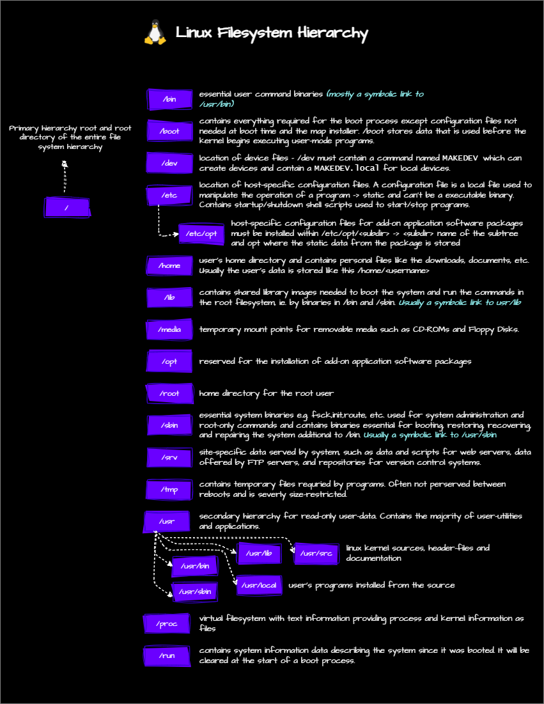

## Basic File Management
This section covers the basic file management tasks in linux. It includes creating, copying, moving, and deleting files and directories. It also includes some examples to practice these tasks.
### Detailed Notes
- [Linux File Systems](/1-linux-fundementals/2-basic-file-management/3-LinuxFileSystems.md)
- [Essential File Management](/1-linux-fundementals/2-basic-file-management/4-EssentialFileManagement.md)
- [Some Examples](/1-linux-fundementals/2-basic-file-management/basic-file-mgmt-examples.md)
### TL;DR
#### Linux File Systems

#### Cheat Sheet
##### Essential File Management

###### cp - Copy files and directories

| Command                                      | Description                                                                 |
|----------------------------------------------|-----------------------------------------------------------------------------|
| `cp /dir/myfile /mydirectory`                | Copy the file to `/mydirectory` which is already created                    |
| `cp -a ~/.* /tmp/`                           | Copy all hidden files and directories from the home directory to `/tmp/`    |
| `cp -r /dir /mydirectory`                    | Copy the directory to `/mydirectory` including all subdirectories and files |
| `cp /etc/passwd /home/.userdata/`            | Copy the passwd file to the .userdata directory in the home directory       |
| `cp -rfv /dir /mydirectory`                  | Copy the directory `/dir` to `/mydirectory` recursively, forcefully, and verbosely |
| `-a` or `--archive`                          | Same as `-dR --preserve=all`                                                |
| `-b` or `--backup`                           | Make a backup of each existing destination file                             |
| `-f` or `--force`                            | Remove without confirmation and asking questions                            |
| `-r` or `--recursive`                        | Copy directories recursively                                                |
| `-p` or `--preserve`                         | Preserve the specified attributes                                           |
| `-v` or `--verbose`                          | Explain what is being done                                                  |

###### mv - Move files and directories

| Command                                      | Description                                                                 |
|----------------------------------------------|-----------------------------------------------------------------------------|
| `mv /dir/myfile /mydirectory`                | Move the file to `/mydirectory` which is already created                    |
| `mv .* /mydirectory`                         | Move all hidden files and directories                                       |
| `-b` or `--backup`                           | Make a backup of each existing destination file                             |
| `-f` or `--force`                            | Remove without confirmation and asking questions                            |
| `-v` or `--verbose`                          | Explain what is being done                                                  |
| `-i` or `--interactive`                      | Prompt before overwriting                                                   |
| `-u` or `--update`                           | Move when the source is newer than the destination                          |

###### rm - Remove files or directories

| Command                                      | Description                                                                 |
|----------------------------------------------|-----------------------------------------------------------------------------|
| `rm /dir/myfile`                             | Remove the file                                                             |
| `rm -r /dir`                                 | Remove the directory and all its contents                                   |
| `rm .*`                                      | Remove all hidden files and directories                                     |
| `-r` or `--recursive`                        | Remove directories and their contents recursively                           |
| `-f` or `--force`                            | Ignore nonexistent files and arguments, never prompt                        |
| `-v` or `--verbose`                          | Explain what is being done                                                  |
| `-i` or `--interactive`                      | Prompt before every removal or `-I` for less intrusive version of `-i`      |
| `-d` or `--dir`                              | Remove empty directories                                                    |
| `rm -rf / --no-preserve-root`                | Remove all files and directories in the root directory (dangerous command)  |

###### touch - Create an empty file

| Command                                      | Description                                                                 |
|----------------------------------------------|-----------------------------------------------------------------------------|
| `touch file.txt`                             | Create an empty file called `file.txt`                                      |
| `touch /tmp/file.txt`                        | Create file `file.txt` in the `/tmp` directory                              |
| `touch .file.txt`                            | Create a hidden file called `.file.txt`                                     |
| `-t` STAMP                                   | Use the specified time instead of the current time                          |
| `-d` or `--date` STRING                      | Parse STRING and use it instead of the current time                         |

###### mkdir - Make directories

| Command                                      | Description                                                                 |
|----------------------------------------------|-----------------------------------------------------------------------------|
| `mkdir /tmp/test`                            | Create a directory called `test` in the `/tmp` directory                    |
| `-p` or `--parents`                          | No error if existing, make parent directories as needed                     |
| `-v` or `--verbose`                          | Explain what is being done                                                  |

###### rmdir - Remove empty directories

| Command                                      | Description                                                                 |
|----------------------------------------------|-----------------------------------------------------------------------------|
| `rmdir /tmp/test`                            | Remove the empty directory `test` in the `/tmp` directory                   |
| `-p` or `--parents`                          | Remove parent directories if they are empty                                 |
| `-v` or `--verbose`                          | Explain what is being done                                                  |

###### ls - List directory contents

| Command                                      | Description                                                                 |
|----------------------------------------------|-----------------------------------------------------------------------------|
| `ls -l`                                      | Long listing format (many details about the files)                          |
| `ls -a`                                      | List all files including hidden files                                       |
| `ls -lh`                                     | List files in long listing format with human-readable file sizes            |
| `ls -ld`                                     | List files in long listing format with human-readable file sizes and sort by date |
| `ls -lrt`                                    | Shows a time-sorted list of files                                           |
| `ls -la`                                     | List all files including hidden files in long listing format                |
| `ls -d b*`                                   | List all directories that start with `b`                                    |

##### Using Wildcards

| Command                                      | Description                                                                 |
|----------------------------------------------|-----------------------------------------------------------------------------|
| `ls a*`                                      | List all files that start with `a`                                          |
| `ls a?*`                                     | List all files that start with `a` and have at least one character after `a`|
| `ls a[bc]*`                                  | List all files that start with `a` and have `b` or `c` as the second character |
| `ls a[^bc]*`                                 | List all files that start with `a` and have any character other than `b` or `c` as the second character |
| `ls a[a-e]*`                                 | List all files that start with `a` and have `a`, `b`, `c`, `d`, or `e` as the second character |
| `touch a{1..5}`                              | Create files `a1`, `a2`, `a3`, `a4`, and `a5`                               |
| `mkdir /data/{sales,marketing,hr}`           | Create directories `sales`, `marketing`, and `hr` in `/data` directory      |
| `ls -d [ab]????`                             | List all files that start with `a` or `b` and have 4 characters after `a` or `b` |
| `touch file_{1..5}.txt`                      | Create files `file_1.txt`, `file_2.txt`, `file_3.txt`, `file_4.txt`, and `file_5.txt` |
| `rm file_{1..5}.txt`                         | Remove files `file_1.txt`, `file_2.txt`, `file_3.txt`, `file_4.txt`, and `file_5.txt` |
| `.[!.]*`                                     | Exclude `.` and `..` directories when working with hidden files and directories |

##### Relative and Absolute Paths

| Path Type       | Description                                                                 |
|-----------------|-----------------------------------------------------------------------------|
| **Relative Path** | Path relative to the current directory                                    |
| `cd /var/log`   | Change the directory to `/var/log`                                          |
| `cd ..`         | Change the directory to the parent directory                                |
| `cd ../..`      | Change the directory to the parent of the parent directory                  |
| `cd ~`          | Change the directory to the home directory                                  |
| `cd -`          | Change the directory to the previous directory                              |
| **Absolute Path** | Path relative to the root directory                                       |
| `cd /var/log`   | Change the directory to `/var/log`                                          |
| `cd /`          | Change the directory to the root directory                                  |
| `cd /root`      | Change the directory to the root user home directory                        |

