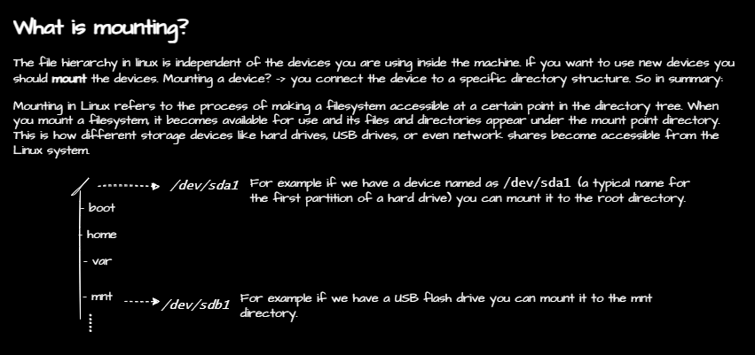

# Mounting File Systems

## Definition

## Managing Mount Points
### `lsblk`
- `lsblk` command lists all block devices.
- `lsblk` with `-f` option will show the filesystem type.
- `lsblk` with `-m` option will show the size in MB.
### `mount`
- `mount` lists all current mounts.
### `df -h`
- `df -h` presents mounted filesystems in human-readable format. It includes the filesystem type, size, used space, available space, and mount point.
### `findmnt`
- `findmnt` command lists all mounts. 
## How to Mount a Device
Pre-requisites:
- a device. In this example, we will use a USB drive.

### Steps
###### First, type `lsblk` to list all block devices

Since we are using a CentOS with a desktop environment, the USB drive is mounted automatically. We should first unmount it. Then mount it manually to wherever we want.

```bash
lsblk
```
output:
```
NAME   MAJ:MIN RM   SIZE RO TYPE MOUNTPOINT
sda      8:0    0 238.5G  0 disk
├─sda1   8:1    0   512M  0 part /boot
└─sda2   8:2    0   238G  0 part 
    ├─cs-root 253:0    0  50G  0 lvm  /
    ├─cs-swap 253:1    0  15G  0 lvm  [SWAP]
sdb      8:16   1  14.9G  0 disk /run/media/user/usb
sr0     11:0    1  1024M  0 rom  /run/media/user/CentOS-Stream-9-BaseOS-x86_64
```
`sdb` is the USB drive. It is mounted at `/run/media/user/usb`. We will unmount it and mount it to `/mnt/usb`.
###### Unmount the device.
```bash
sudo umount /dev/sdb
``` 
###### Mount the device to the mount point.
Create a mount point. For example, 
```bash
sudo mkdir /mnt/usb
```
then mount the device to the mount point.
```bash
sudo mount /dev/sdb /mnt/usb
```
###### Check what you see in the temporary mount point.
```bash
ls /mnt/usb
```
output:
```
hosts
```
let's copy some files to the USB drive.
```bash
sudo cp /home/user/Downloads /mnt/usb
```
now check the USB drive.
```bash
ls /mnt/usb
```
output:
```
hosts Downloads
```
The downloads directory is copied to the USB drive. (not on sda2 i.e.)
###### List the block devices again to see the mount point.
```bash
lsblk
```
output:
```
NAME   MAJ:MIN RM   SIZE RO TYPE MOUNTPOINT
sda      8:0    0 238.5G  0 disk
├─sda1   8:1    0   512M  0 part /boot
└─sda2   8:2    0   238G  0 part 
    ├─cs-root 253:0    0  50G  0 lvm  /
    ├─cs-swap 253:1    0  15G  0 lvm  [SWAP]
sdb      8:16   1  14.9G  0 disk /mnt/usb
sr0     11:0    1  1024M  0 rom  /run/media/user/CentOS-Stream-9-BaseOS-x86_64
```
- The USB drive is mounted at `/mnt/usb`.
- When you want to see more detailed list of mounts, use `findmnt`.
- If you want to know the free space available on mounts and in a human-readable format, use `df -h`.
###### To unmount the device, use `umount`.
```bash
sudo umount /mnt/usb
```
now see what is in the mount point.
```bash
ls /mnt/usb
```
output:
```
hgfs
```
The USB drive is unmounted.

