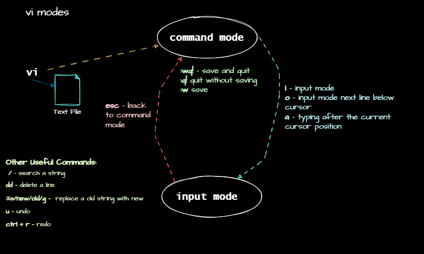

# Text Editors in Linux
## Text Editors
- Text editors are used to create and edit text files in linux.
- There are many text editors available in linux, some are command-line based and some are graphical.
- Some of the popular text editors in linux are `vi`, `nano`, `gedit`, `vim`, etc.
- To change the default text editor in linux, use 
```bash
export EDITOR=$(which <editorname>)
```
***Example:***
```bash
export EDITOR=$(which nano)
```
### Some Text Editors in Linux
#### `vi`
- `vi` is a text editor that is available in almost all linux distributions.
- `vi` is a modal editor, which means it has different modes for different operations.
- `vi` has two modes: `command mode` and `insert mode`.
- To enter `insert mode`, press `i` in `command mode`.
- To exit `insert mode`, press `Esc` key.
- To save and exit `vi`, press `Esc` key to enter `command mode`, then type `:wq` and press `Enter`.
- To exit `vi` without saving, press `Esc` key to enter `command mode`, then type `:q!` and press `Enter`.
- To search for a string in `vi`, press `/` and type the string to search.
- To search and replace a string in `vi`, press `:` and type `s/old/new/g` and press `Enter`.
##### `vi` modes
- `command mode`: default mode, used for navigation, search, etc.
- `insert mode`: used for inserting text.


***Example:***
```bash
vi /tmp/newtextfile.txt
```
now type in `i` to enter insert mode and type some text. To save and exit, press `Esc` key to enter `command mode`, then type `:wq` and press `Enter`.
```text
This is an example, now save this and search
```
now search for `this` and then replace it with `newthis`.
```vi
:s/this/newthis/g
```
***output:***
```text
newthis is an example, now save newthis and search
~
~
~
:s/this/newthis/g                           1,1          All
```
#### `nano`
- `nano` is a simple text editor that is available in some linux distributions and is very easy to use.
- use `ctrl` key with `x` to exit `nano`.
- use `ctrl` key with `s` to save the file.
#### `gedit`
- `gedit` is a graphical text editor that is available in few linux distributions by default.
- `gedit` is easy to use and has a lot of features.
- `gedit` is a good choice for beginners, since it's graphical. 

#### `vim` vi improved
- `vim` is an improved version of `vi` and is available in some linux distributions.
- It's more powerful and has more features than `vi`. But also has a steeper learning curve.
- `vim` has three modes: `normal mode`, `insert mode`, and `visual mode`.
- To enter `insert mode`, press `i` in `normal mode`.
- To exit `insert mode`, press `Esc` key to enter `normal mode`.
- To save and exit `vim`, press `Esc` key to enter `normal mode`, then type `:wq` and press `Enter`.
- To exit `vim` without saving, press `Esc` key to enter `normal mode`, then type `:q!` and press `Enter`.
- use `o` to insert a new line below the cursor in `normal mode`.
- `:wq!` to save and exit forcefully.
- `u` to undo the last operation.
- `ctrl` key with `r` to redo the last operation.
- `dd` to delete a line.
- `:%s/old/new/g` to search and replace all occurrences of `old` with `new`.
- to clear highlighted search results, press `Esc` key to enter `normal mode`, then type `:noh` and press `Enter`.
- use `vimtutor` to learn `vim` interactively.
##### `vim` modes
- `normal mode`/`command mode`: default mode, used for navigation, search, etc.
- `insert mode`: used for inserting text.
- `visual mode`: used for selecting text.

### essential cheat sheet 
| Command | Description | Example |
| --- | --- | --- |
| `vi` | open a file in `vi` | `vi /tmp/newfile.txt` |
| `vim` | open a file in `vim` | `vim /tmp/newfile.txt` |
| `nano` | open a file in `nano` | `nano /tmp/newfile.txt` |
| `gedit` | open a file in `gedit` | `gedit /tmp/newfile.txt` |
#### `vi` and `vim` commands
| Command | Description |
| --- | --- | 
| `w` | save the file | 
| `b` | move to the beginning of the word | 
| `^` | move to the beginning of the line | 
| `$` | move to the end of the line |
| `dw` | delete a word |
| `dd` | delete a line |
| `u` | undo the last operation |
| `ctrl` + `r` | redo the last operation |
| `o` | insert a new line below the cursor |
| `O` | insert a new line above the cursor |
| `:se number` | show line numbers |
| `r` | replace a character |
| `:%s/old/new/g` | search and replace all occurrences of `old` with `new` |
| `:noh` | clear highlighted search results |
| `:wq` | save and exit |
| `:q!` | exit without saving |
| `:wq!` | save and exit forcefully |
| `i` | enter insert mode |
| `Esc` | exit insert mode |
| `v` | enter visual mode |	
| `ctrl` + `v` | enter visual block mode |
| `y` | copy selected text |    
| `p` | paste copied text |
| `x` | delete selected text |
| `yy` | copy a line |
