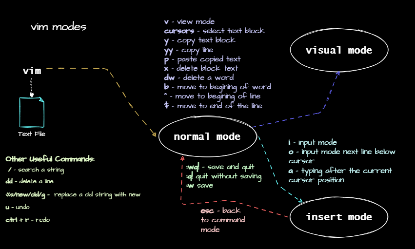

# Review and cheat sheets
## Text Editors in Linux
- `vi` is a text editor that is available in almost all linux distributions.
- `vim` is an improved version of `vi` with more features.
- `nano` is a simple text editor that is available in some linux distributions.
- `gedit` is a graphical text editor that is available in few linux distributions by default.
- To change the default text editor in linux, use 
```bash
export EDITOR=$(which <editorname>)
```
### cheat sheet
| Command | Description | Example |
| --- | --- | --- |
| `vi` | open a file in `vi` | `vi /tmp/newfile.txt` |
| `vim` | open a file in `vim` | `vim /tmp/newfile.txt` |
| `nano` | open a file in `nano` | `nano /tmp/newfile.txt` |
| `gedit` | open a file in `gedit` | `gedit /tmp/newfile.txt` |
#### ``vi`` and ``vim``
| Command | Description |
| --- | --- | 
| `w` | save the file | 
| `b` | move to the beginning of the word | 
| `^` | move to the beginning of the line | 
| `$` | move to the end of the line |
| `dw` | delete a word |
| `dd` | delete a line |
| `u` | undo the last operation |
| `ctrl` + `r` | redo the last operation |
| `o` | insert a new line below the cursor |
| `O` | insert a new line above the cursor |
| `:se number` | show line numbers |
| `r` | replace a character |
| `:%s/old/new/g` | search and replace all occurrences of `old` with `new` |
| `:noh` | clear highlighted search results |
| `:wq` | save and exit |
| `:q!` | exit without saving |
| `:wq!` | save and exit forcefully |
| `i` | enter insert mode |
| `Esc` | exit insert mode |
| `v` | enter visual mode |	
| `ctrl` + `v` | enter visual block mode |
| `y` | copy selected text |    
| `p` | paste copied text |
| `x` | delete selected text |
| `yy` | copy a line |
### modes in ``vi`` and ``vim``
#### ``vi`` modes

#### ``vim`` modes


## Browsing and Searching Text Files
### ``more`` and ``less``, ``head`` and ``tail``, `cat` and ``grep``
#### cheat sheets
##### `head` and `tail`
|Command | 	Description|
| --- | --- |
|head file.txt | Display the first 10 lines of file.txt.
|head -n 5 file.txt	 | Display the first 5 lines of file.txt.
|head -c 20 file.txt |	Display the first 20 bytes of file.txt.
|tail file.txt	| Display the last 10 lines of file.txt.
|tail -n 5 file.txt	| Display the last 5 lines of file.txt.
|tail -f file.txt	| Follow the content of file.txt as it grows.
|tail -c 20 file.txt	| Display the last 20 bytes of file.txt.


`ls -l | head -n 5` - ***Display the first 5 lines of the output of ls -l.***
`ls -l | tail -n 5` - ***Display the last 5 lines of the output of ls -l.***
`ls -l | tail -n 5 | head -n 1` - ***Display the output of ls -l starting from line 5.***

Use `-f` option with `tail` to follow the content of a file as it grows, the so called `live mode`. 

##### `cat` Command Cheatsheet
|Command | 	Description|
| --- | --- |
|`cat file.txt`|	Display the content of file.txt.
|`cat file1.txt file2.txt`|	Concatenate and display the content of file1.txt and file2.txt.
|`cat -n file.txt`|	Display the content of file.txt with line numbers.
|`cat file.txt > newfile.txt`|	Redirect the content of file.txt to newfile.txt.
|`cat -b file.txt`|	Display the content of file.txt with line numbers, skipping blank lines.
|`cat -s file.txt`|	Display the content of file.txt, squeezing blank lines.

***Use `-A` option is used to display all characters, including non-printing characters.***


##### ``more`` and ``less`` Command Cheatsheet
|Command | 	Description|
| --- | --- |
|`more file.txt`|	View the content of file.txt one screen at a time.
|`more -N file.txt`|	View the content of file.txt with line numbers.
|`less file.txt`|	View the content of file.txt one screen at a time.
|`less -N file.txt`|	View the content of file.txt with line numbers.

- use `-f` option to view the file in follow mode. Available with `less` command.

##### ``grep`` Command Cheatsheet
|Command | 	Description|
| --- | --- |
|`grep root *`|	Search for the string root in all files in the current directory.
|`grep -i root *`|	Search for the string root in all files in the current directory, ignoring the case.
|`grep -r root /etc`|	Search for the string root in all files in the /etc directory recursively.
|`grep -v root *`|	Invert the match, displaying lines that do not contain root.
|`grep -l root *`|	Display only the names of files that contain root.
|`grep -A5 root *`|	Display 5 lines after each match of root.
|`grep -B5 root *`|	Display 5 lines before each match of root.
|`grep -C5 root *`|	Display 5 lines before and after each match of root.
|`grep root * 2>/dev/null`|	Suppress error messages while searching for root.

###### Using `grep` while piping
```bash
ls -l /etc | grep root
```
***This will search for the string `root` in the output of `ls -l /etc`.***
```bash	
ls -l /etc | grep root | grep -v user
```
***This will search for the string `root` in the output of `ls -l /etc` and exclude the lines that contain `user`.***
```bash
ps aux | grep http
```
***this will search for the string `http` in the output of the `ps aux` command.***
