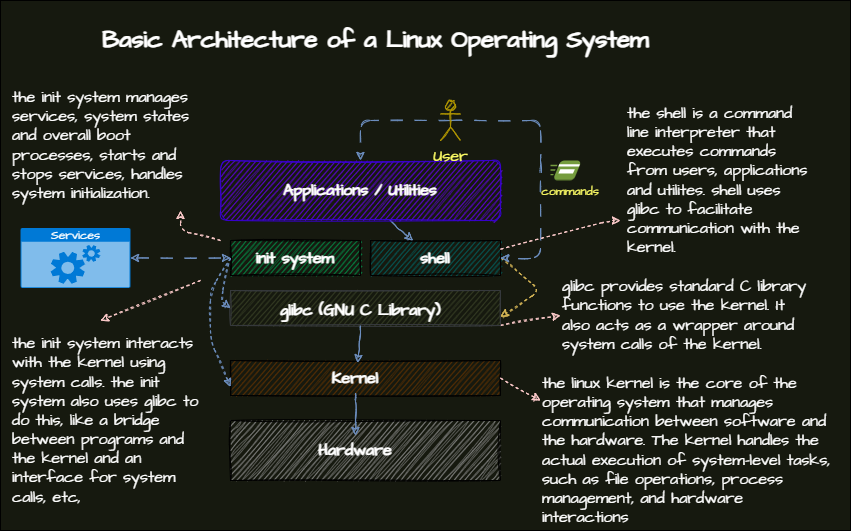

# Bash
## Detailed Notes
- [Shell](/1-linux-fundementals/6-bash/shell.md)

## Review

### Linux Basic Architecture

### Redirection and Piping
#### Redirection
- ``>``, ``>>``: Redirects output to a file. ``>`` overwrites the file, ``>>`` appends to the file.
- Standard error is redirected with ``2>`` or also ``&>``. The latter redirects both standard output and standard error.
#### Piping
- used to send the output of one command to another command.
```bash
ps aux | grep http
ls -l | grep myfile | less
```
##### ``tee``	
- is used to combine the redirection and piping.
```bash
ls -l | tee file.txt | less
ps aux | tee psfile | grep ssh
```
### ``history`` 
-  ``history`` command shows the history of commands. written to ``~/.bash_history``.
#### Command Options

| Option    | Description                              |
|-----------|------------------------------------------|
| `-c`      | Clears the history.                      |
| `-w`      | Writes the history to the file.          |
| `-r`      | Reads the history from the file.         |
| `-d`      | Deletes a specific line from the history.|
| `-a`      | Appends the history to the file.         |
| `CTRL+R`  | Search the history.                      |
| `!n`      | Executes the command number `n`.         |
##### Command Line Completion
- ``TAB`` key can be used to complete the command or filename.
- Some packages can be used for better auto-completion. See [here](misc\zsh-autocompleting.md)
#### Variables and Environment Variables
## Summary Table

### Variables and Environment Variables

| Topic                     | Description                                                                 |
|---------------------------|-----------------------------------------------------------------------------|
| Set a variable and print | `MYVAR=hello`<br>`echo $MYVAR`                                              |
| Exporting Variables  | Make variables available to other shells.<br>Example: `export MYVAR=hello`<br>`echo $MYVAR` |
| View Environment Variables| Use the `env` command to see environment variables.                    |

#### Important Environment Variables

| Variable | Description                                      |
|----------|--------------------------------------------------|
| `PATH`   | Directories where the shell looks for commands.  |
| `HOME`   | Home directory of the user.                      |
| `PWD`    | Current working directory.                       |
| `USER`   | Username of the user.                            |
| `SHELL`  | Shell that is being used.                        |
| `EDITOR` | Default editor.                                  |
| `LANG`   | Language settings.                               |
| `TERM`   | Terminal type.                                   |
| `PS1`    | Prompt settings.                                 |

### Other Bash Features
## Summary Tables

### Aliases

| Command       | Description                          |
|---------------|--------------------------------------|
| `alias`       | Create shortcuts for commands.       |
| `unalias`     | Remove an alias.                     |
|   `alias <alias-name>='<the command>'` | making an alias for a command |


### Shortcuts

| Shortcut | Description                          |
|----------|--------------------------------------|
| `CTRL+C` | Interrupts the current process.      |
| `CTRL+Z` | Stops the current process.           |
| `CTRL+D` | Logs out of the current shell.       |
| `CTRL+L` | Clears the screen.                   |
| `CTRL+A` | Moves the cursor to the beginning of the line. |
| `CTRL+E` | Moves the cursor to the end of the line. |
| `CTRL+U` | Deletes the line before the cursor.  |
| `CTRL+K` | Deletes the line after the cursor.   |

### Bash Startup Files

| File                  | Description                          |
|-----------------------|--------------------------------------|
| `/etc/profile`        | System-wide settings.                |
| `/etc/profile.d/`     | Additional settings.                 |
| `/etc/bashrc`         | System-wide bash settings.           |
| `~/.bashrc`           | User-specific bash settings.         |
| `~/.bash_profile`     | User-specific settings.              |
| `~/.bash_logout`      | User-specific settings when logging out. |
| `/etc/environment`    | System-wide environment settings.    |