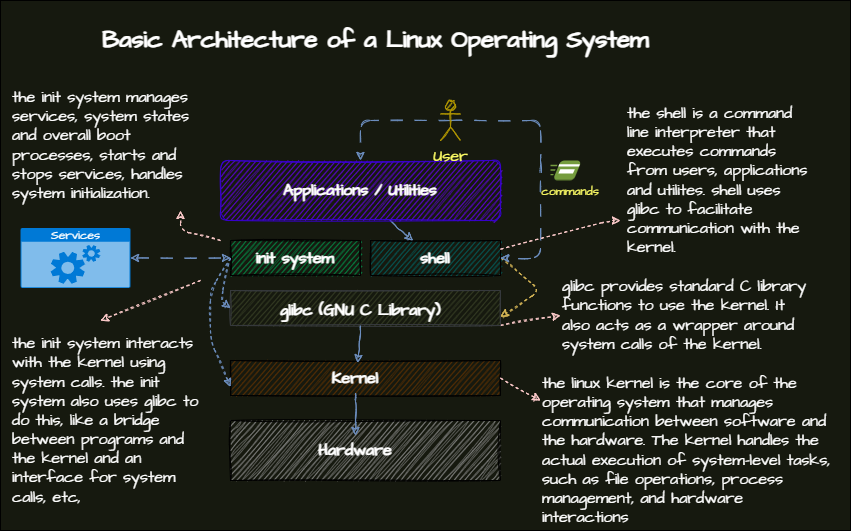

## Understanding the Linux System Structure
- The basis of the Linux system is the kerenel and its libraries. These libraries are offered by GNU and are called the GNU C Library ``glibc``. Kernel is where the operating system communicates with the hardware.
- The shell is the user interface between to kernel and glibc. It is a command line interpreter that allows users to interact with the system, it reads commands from the user and executes them.
- Other than commands we also have services that run in the background, these are called daemons. They are administrated by the init system. The init system is responsible for starting and stopping services, and it also manages the system runlevels. Examples of init systems are ``systemd`` and ``SysV``. The init system is directly communicating with the kernel and glibc.



## Working with the Bash Shell
### I/O Redirection and Piping
#### Redirection
- Redirection is to manipulate the input and output of commands.
    - ``>``, ``>>``: Redirects output to a file. ``>`` overwrites the file, ``>>`` appends to the file.
        - Example: ``ls > file.txt``. 
    - ``<``: Redirects input from a file. Used less frequently. 
        - Example: ``sort < /etc/services``. 
    - Standard error is redirected with ``2>`` or also ``&>``. The latter redirects both standard output and standard error.
        - Example: ``grep -R root /proc 2>dev/null``.
        - Example: ``grep -R root /etc &> ~/myfile``.
#### Piping
- used to send the output of one command to another command.
    - Example: ``ps aux | grep http``.
    - Example: ``ls -l | grep myfile | less``.
##### ``tee``
- ``tee`` is used to combine the redirection and piping. it allows you to write output to a file and simultaneously use it as input for another command.
    - Example: ``ls -l | tee file.txt | less``.
    - Example: ``ps aux | tee psfile | grep ssh``.
### Working with History
- ``history`` command shows the history of commands. written to ``~/.bash_history``.
- Frequently used to acess previously executed commands can be accessed by using the up and down arrow keys.
- ``history`` command can be used with options:
    - ``-c``: clears the history.
    - ``-w``: writes the history to the file.
    - ``-r``: reads the history from the file.
    - ``-d``: deletes a specific line from the history.
    - ``-a``: appends the history to the file.
    - ``CTRL+R``: search the history.
    - ``!n``: executes the command number ``n``.
#### Command Line Completion
- ``TAB`` key can be used to complete the command or filename.
- There are also many different packages that can be installed to enhance the completion.
### Using Variables
- Variables are used to store data. They can be used to store strings, integers, or arrays. It is used in scripts to store data that can be used later.
```bash
MYVAR=hello
echo $MYVAR
```
- Frequent example: environment variables. 
- Variables are known to the current shell, in order to make them available to other shells, they need to be exported.
        - Example: ``export MYVAR=hello``.
        - Use ``echo $MYVAR`` to print the variable.
#### Environment Variables
- see the environment variables with the ``env`` command.
- Important environment variables:
    - ``PATH``: contains the directories where the shell looks for commands.
    - ``HOME``: the home directory of the user.
    - ``PWD``: the current working directory.
    - ``USER``: the username of the user.
    - ``SHELL``: the shell that is being used.
    - ``EDITOR``: the default editor.
    - ``LANG``: the language settings.
    - ``TERM``: the terminal type.
    - ``PS1``: the prompt settings. 
### Other Bash Features
#### Aliases
- Aliases are used to create shortcuts for commands. They are defined in the ``~/.bashrc`` file.
    - Example: 
    ```bash 
    alias ll='ls -l'
    alias rm='rm -i'
    alias cp='cp -i'
    alias mv='mv -i'
    ```
- Usage:
    - making an alias ``list`` for ``ls -lia``.
     ```bash
     alias list='ls -lia'
     ``` 
     - making an alias ``update`` for ``sudo apt update``.
     ```bash
    alias update='sudo apt-get update'
    ```
    - making an alias ``upgrade`` for ``sudo apt upgrade``.
    ```bash
    alias upgrade='sudo apt-get upgrade'
    ```
    - making an alias ``install`` for ``sudo apt install``.
    ```bash
    alias install='sudo apt-get install'
    ```
    ```bash
    install htop
    ```
    instead of 
    ```bash
    sudo apt install htop
    ```
    - making an ``delete`` alias for a recursive delete command. ``rm -rf``.
    ```bash
    alias delete='rm -rf'
    ```
    - making an alian ``dirmake`` for ``mkdir -p``.
    ```bash
    alias dirmake='mkdir -p'
    ```
    - making an alias ``saplxmlt`` to run a python application.
    ```bash
    alias saplxmlt='python3 /path/to/saplxmlt/app.py'
    ```
##### unalias
- To remove an alias, use the ``unalias`` command.
    - Example: ``unalias ll``.
#### Shortcuts
- ``CTRL+C``: interrupts the current process.
- ``CTRL+Z``: stops the current process.
- ``CTRL+D``: logs out of the current shell.
- ``CTRL+L``: clears the screen.
- ``CTRL+A``: moves the cursor to the beginning of the line.
- ``CTRL+E``: moves the cursor to the end of the line.
- ``CTRL+U``: deletes the line before the cursor.
- ``CTRL+K``: deletes the line after the cursor.
### Bash Startup Files
- ``/etc/profile``: system-wide settings.
    - ``/etc/profile.d/``: additional settings.
    - ``/etc/bashrc``: system-wide bash settings.
      - ``~/.bashrc``: user-specific bash settings.
    - ``~/.bash_profile``: user-specific settings.  
    - ``~/.bash_logout``: user-specific settings when logging out.
- ``/etc/environment``: system-wide environment settings.
  - usually empty or non-existent in some distributions. 