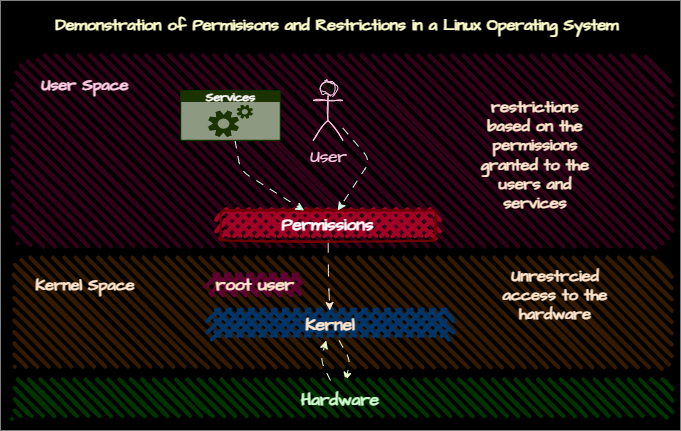

# User and Group Management
## Understanding Users and Groups
- **User**: A user is an entity that is used to grant specific permissions of differetn parts of a linux operating system, each user has a unique username and a unique user ID (UID) assigned to them.
- **Group**: A group is a collection of users, each user can be a member of one or more groups, each group has a unique group ID (GID) assigned to them.


### Groups
- When a user creates a file, it becomes the owner. Every user has at least one group and that group is also the default owner of the files created by the user.
#### Private Groups
- Many Linux distributions create a private group for each user, with the same name as the username. This group is the default group for the user.
##### Quick Demo
- let's see what user are we logged in as, type `id` in the terminal.
```bash
id
```
```
uid=1000(testuser) gid=1000(testuser) groups=1000(testuser),4(adm),10(wheel),11(cdrom)
```
- The output shows the user ID, group ID, and the groups the user is a member of. 
    - ``gid`` : primary group ID 
- let's create a file and see the owner. 
```bash
touch /tmp/temp.txt
ls -lia /tmp/temp.txt
```
```
3044 -rw-r--r-- 1 testuser testuser 0 Sep 12 15:31 /tmp/temp.txt
```
- The output shows the owner and group of the file, which is ``testuser`` in this case. The group is also ``testuser``. Firstly is the user, secondly is the group.
    - first column: inode number
    - second column: permissions 
        - first ``rw`` permission is for the owner (user) 
        - second ``r`` permission is for the group
        - third ``r`` permission is for others
## User Management
### Creating Users
- use the `useradd` command to create a new user. 
- Also a user needs a home directory, which is not given by default. so we need to use the `-m` option to create a home directory for the user. the `-s` option is used to set the default shell for the user, in the example below we set the default shell to `/bin/bash`.
```bash
sudo useradd -m -s /bin/bash newuser
```
- The user is created but the password is not set. To set the password, use the `passwd` command.
```bash
sudo passwd newuser
```
the use ``grep newuser /etc/passwd`` to see the user details and if it's created successfully.
```bash
grep newuser /etc/passwd
```
```
newuser:x:1001:1001::/home/newuser:/bin/bash
```
- Use ``useradd -D`` to get an overview of currently effective default settings. 
```bash
useradd -D
```
```
GROUP=100
HOME=/home
INACTIVE=-1
EXPIRE=
SHELL=/bin/bash
SKEL=/etc/skel
CREATE_MAIL_SPOOL=yes
```
- The output shows the default settings for the useradd command. 
    - ``GROUP``: default group ID
    - ``HOME``: default home directory
    - ``INACTIVE``: number of days after the password expires
    - ``EXPIRE``: date when the account expires
    - ``SHELL``: default shell
    - ``SKEL``: directory containing default files
    - ``CREATE_MAIL_SPOOL``: whether to create a mail spool file
### Deleting Users
- To delete a user, use the `userdel` command.
- The `-rf` option is used to remove the user's home directory and mail spool forecefully.
```bash
sudo userdel -rf newuser
```
if the user didn't have a home directory, we will get an error message. To fix it use ``useradd`` with ``-m`` option for the same user again to create a home directory.
- The user is deleted, use ``grep newuser /etc/passwd`` to see if the user is deleted successfully.
```bash
grep newuser /etc/passwd
```
### Creating Groups
- use ``groupadd`` command to create a new group.
```bash
sudo groupadd newgroup
```
- add users to a group using the `usermod` command.
```bash
sudo usermod -aG newgroup newuser
```
- groups are stored in ``/etc/group`` file. use ``grep newgroup /etc/group`` to see the group details.
```bash
grep newgroup /etc/group
```
```
newgroup:x:1004:newuser
```
##### ``groupdel`` and ``groupmod`` commands
- To delete a group, use the `groupdel` command.
```bash
groupdel newgroup
```
- To modify a group, use the `groupmod` command.
```bash
groupmod -n newgroup2 newgroup
```
- The `-n` option is used to change the group name.
- use `-p` option to change the group password.
```bash
groupmod -p newpassword newgroup2
```
### Managing User and Groups Properties
#### User Properties
- User and group properties are stored in the `/etc/passwd` and `/etc/group` files.
   - properties of a user
       - ``uid``: user ID
       - ``gid``: group ID (primary group)
       - ``gecos``: user information, comments(optional) 
       - ``home``: home directory
       - ``shell``: default shell (bash,zsh,etc)
    - use ``getent passwd username`` to see the user properties in the `/etc/passwd` file.
    - Passwords are stored in the `/etc/shadow` file.
    - Use ``vipw`` command to edit the `/etc/passwd` and `/etc/shadow` file directly.
    - explaining the fields in the `/etc/passwd` file.
        - ``username:password:uid:gid:gecos:home:shell``
          - ``username``: user name
          - ``password``: password (x means password is stored in the `/etc/shadow` file)
          - ``uid``: user ID
          - ``gid``: group ID
          - ``gecos``: user information
          - ``home``: home directory
          - ``shell``: default shell
        - Example: 
            ```bash
            testuser:x:1000:1000:Test User:/home/testuser:/bin/bash
            ```
          - ``testuser``: username
          - ``x``: password is stored in the `/etc/shadow` file
          - ``1000``: user ID
          - ``1000``: group ID
          - ``Test User``: user information
          - ``/home/testuser``: home directory
          - ``/bin/bash``: default shell
 #### Group Properties
 - stored in ``/etc/group``
 - Users that are a group member of as a secondary group are stored in the `/etc/group` file too. 
 - Primary goup membership of a user is only maintained in the `/etc/passwd` file.
 - user ``vigr`` command to edit the `/etc/group` and `/etc/gshadow` file directly.

### Configuring Defaults
#### ``useradd -D`` command
- the `useradd -D` command is used to get an overview of the currently effective default settings.
#### ``/etc/login.defs`` file
- The `/etc/login.defs` file contains the default settings for useradd and usermod commands. it will effect the new users created (not the existing users).
    - for example change the required password length, days before password expires, etc. 
#### ``/etc/skel`` directory
- The `/etc/skel` directory contains the default files that are copied to the new user's home directory when a new user is created.
    - ``bash_logout``: executed when the user logs out
    - ``bash_profile``: executed when the user logs in
    - ``bashrc``: executed when the user starts a new shell
    - ``zshrc``: executed when the user starts a new zsh shell (if zsh is installed) 
- if we want any new user to have a specific file in their home directory, we can add it to the `/etc/skel` directory.
### Managing Passwords
#### ``passwd``
- The `passwd` command is used to change the password of a user.
```bash	
passwd username
```
#### ``chage``
- The `chage` command is used to change the password expiry information.
```bash
chage -l username
```
- use ``chage username`` to change the password expiry information.
```bash
sudo chage username
```
#### ``passwd -S`` 
- Use ``passwd -S`` to see the password status of a user.
```bash
sudo passwd -S username
```
```
username PS 2024-08-28 0 99999 7 -1 (Password set, SHA512 crypt.)
```
#### change passwords withut prompting
- use ``echo`` and ``|`` to change the password without prompting.
  - RedHat based systems use ``echo "newpassword" | sudo passwd --stdin username``.
    ```bash
    echo password | sudo passwd --stdin username
    ```
  - Debian based systems use ``echo "username:newpassword" | sudo chpasswd``.
    ```bash
    echo "username:newpassword" | sudo chpasswd
    ```
##### Demo
- ###### create a new user and set the password to expire in 900 days.
```bash
 sudo useradd -m -s /bin/zsh new
 sudo passwd new
 sudo chage new
```
```
Changing the aging information for new
Enter the new value, or press ENTER for the default

        Minimum Password Age [0]: 1
        Maximum Password Age [99999]: 900
        Last Password Change (YYYY-MM-DD) [2024-09-12]:
        Password Expiration Warning [7]:
        Password Inactive [-1]:
        Account Expiration Date (YYYY-MM-DD) [-1]: 2022-12-21
```
- ###### investigate password properties of the user using /etc/shadow file.
```bash
sudo grep new /etc/shadow
```
```
new:$6$PIp9kiqKQQtetlzt$QM8kYJbHj0H8tkvgfAfy1GNubXEc/S7u1H/HtPQfpZAgDN6UVA36tLLtZ2KTer5lXHwBgtWRUxnTrvY9vbx2E/:19978:1:900:7::19347:
```
  - ``new``: username
  - ``$6$PIp9kiqKQQtetlzt$QM8kYJbHj0H8tkvgfAfy1GNubXEc/S7u1H/HtPQfpZAgDN6UVA36tLLtZ2KTer5lXHwBgtWRUxnTrvY9vbx2E/``: password hash
  - ``19978``: last password change date
  - ``1``: minimum password age
  - ``900``: maximum password age
  - ``7``: password expiration warning
  - ``19347``: account expiration date
- ###### Investigate the password properties of the user using ``passwd -S`` command.
```bash
sudo passwd -S new
```
```
new PS 2024-09-12 1 900 7 -1 (Password set, SHA512 crypt.)
```
- ``new``: username
- ``PS``: password status
- ``2024-09-12``: last password change date
- ``1``: minimum password age
- ``900``: maximum password age
- ``7``: password expiration warning
- ``-1``: account expiration date
- ``Password set, SHA512 crypt.``: password set and encrypted using SHA512
### Session Management
- ``who`` and ``w`` commands are used to see the users currently logged in.
- ``loginctl`` command is used to see the user sessions.
    - ``loginctl list-sessions``: list all the sessions
    - ``loginctl show-session sessionID``: show the details of a specific session
    - ``loginctl terminate-session sessionID``: terminate a specific session
    - ``loginctl show-user username``: show the details of a specific user
    - ``loginctl kill-user username``: terminate all the sessions of a specific user 
