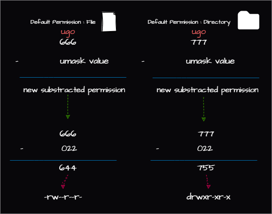

# Permissions and Ownership Management in Linux
## Review
- ```ls -l``` command is used to list files and directories in a long format.
- `u` (User), `g` (Group), and `o` (Others)
- ``+`` (Add), ``-`` (Remove), and ``=`` (Set)
- ``chmod`` command is used to change file permissions.
- ``chown`` command is used to change file ownership.
- ``chgrp`` command is used to change file group ownership.
- ``umask`` command is used to substract permissions from the default permissions.
### Basic Linux Permissions
| Permission | Description | Octal Value | Symbol |
| --- | --- | --- | --- |
| r | Read | 4 | r-- |
| w | Write | 2 | -w- |
| x | Execute | 1 | --x |
| - | No Permission | 0 | --- |

### Examples
- ``chmod u+x file``: add execute permission to user
- ``chmod g-w file``: remove write permission from group
- ``chmod o=r file``: set read permission to others
- ``chmod a=rwx file``: set read, write, execute permission to all
- ``chmod 777 file``: set read, write, execute permission to all
**basically ``chmod <u><g><o> <file>`` where ``<u>``, ``<g>``, ``<o>`` are 3 digit numbers where each digit represents the permission for user, group and others respectively.**
- ``chmod 755 file``: set read, write, execute permission to user and read, execute permission to group and others.
- ``chmod 644 file``: set read, write permission to user and read permission to group and others.
- ``chmod 744 file``: set read, write, execute permission to user and read permission to group and others.
- ```chmod 750 file```: set read, write, execute permission to user and read permission to group.

- ``chown parham:hosting_team /etc/nginx/nginx.conf``: change the ownership of the file to user parham and group hosting_team
  	- usage: ``chown <user>:<group> <file>`` 
- example: ``chgrp hosting_team /etc/nginx/nginx.conf``: change the group ownership of the file to hosting_team
   -  usage: ``chgrp <group> <file>``
### Advanced Linux Permissions
| Feature       | Command                | Description                                                                 |
|---------------|------------------------|-----------------------------------------------------------------------------|
| **Set User ID (SUID)** | `chmod u+s file`       | Lets the user run as the user-owner of the file.                             |
|               | `chmod u-s file`       | Remove SUID.                                                                |
| **Set Group ID (SGID)** | `chmod g+s file`       | Lets the user run as the group-owner of the file.                            |
| **Sticky Bit** | `chmod +t directory`   | Only user-owner of the file or directory can delete files in the directory.  |
|               | `chmod -t directory`   | Remove sticky bit.                                                          |

#### Monitoring SUID and SGID Permissions

| Command                                | Description                                      |
|----------------------------------------|--------------------------------------------------|
| `sudo find / -type f -perm /6000 -ls`  | Find files with either SUID or SGID set (or both).|
| `sudo find / -type f -perm /4000 -ls`  | Find files with SUID set.                        |
| `sudo find / -type f -perm /2000 -ls`  | Find files with SGID set.                        |
| `sudo find / -type d -perm /1000 -ls`  | Find directories with Sticky Bit set.            |
### ``umask``
**Note: ``umask`` only deducts the permissions from the default permissions.**
| ``umask`` value octal | File Permission (-) |Description| Directory Permission (d) | Description |
|-------|-----------------|----|----------------------|-------------|
|**0** | **6 (-rw-)** | **No Execution (Default for a File Permission)** | **7 (drwx)** | **All Permissions (Default Directory Permission)** |
|**1** | **5 (-r-x)** | **No Write Permission** | 6 (drw-) | No Execution (not able to ``cd``) |
| **2** | **4 (-r--)** | **Only Read Permission** | **5 (dr-x)** | **No Write Permission** |
| **3** | 3 (--wx) | No Read Permission | **4 (d-r-)** | **Only Read Permission** |
| **4** | 2 (--w-) | Only Write Permission | 3 (d-wx) | No Read Permission |
| **5** | **1 (-x--)** | **Only Execution Permission** | 2 (d-w-) | Only Write Permission |
| **6** | **0 (---)** | **No Read, Write, and Execute Permission** | 1 (d--x) | Only Execution Permission |
| **7** | Not Relevant | Not Relevant | **0 (d---)** | **No Read, Write, and Execute Permission** |
#### Examples
| ``umask`` value | File Permission | Directory Permission | Description |
|-----------------|-----------------|----------------------|--|
| 022 | 644 | 755 | File: ``-rw-r--r--`` Directory: ``drwxr-xr-x`` |
| 027 | 640 | 750 | File: ``-rw-r-----`` Directory: ``drwxr-x---`` |
| 077 | 600 | 700 | File: ``-rw-------`` Directory: ``drwx------`` |
| 122 | 544 | 655 | File: ``-r-xr--r--`` Directory: ``drw-r-xr-x`` |
#### Best Method to Calculate ``umask`` 

