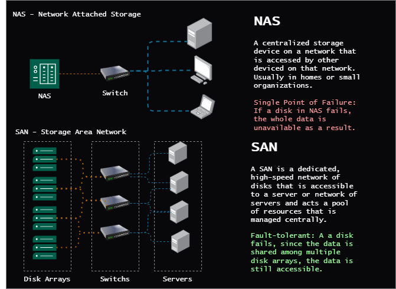
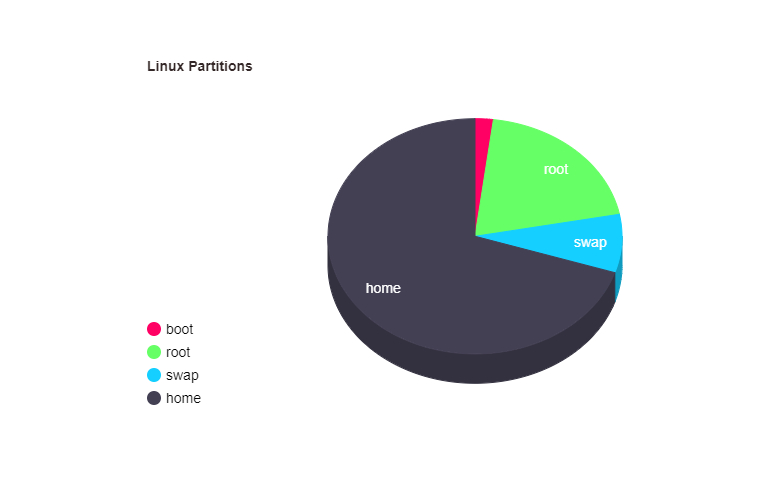

# Storage Management in Linux
A detailed note on storage management in Linux below:
- [Storage Management](/2-usergrouppermissions/3-storagemgmt/storage.md) - Understanding storage management, mounting, unmounting, etc.
- [A Comprehensive Demo of Partitioning and Mounting in Linux](/2-usergrouppermissions/3-storagemgmt/storage.md/#comprehensive-demo)

## Summary
### Storage in Linux
``/dev`` directory contains all devices in Linux. We address devices using the ``/dev`` directory as device files. These device files should be used to partition and format the storage devices and mount them to the file system in their mount points.
we have internal and external storage devices. Internal storage devices are hard drives, SSDs, etc. External storage devices are USB drives, external hard drives, NAS, SAN, etc.

#### NAS and SAN

### Linux Partitions

- **boot** : Contains the boot loader and kenrnel files for booting the system.
- **root** : Contains the root file system and practically where the operating system is installed.
- **swap** : Contains the swap space and acts as a overflow for the RAM when it is full.
- **home** : Contains the user's personal files and other data.
### File Systems
A file system is how the data is managed on the partition. The file system is responsible for indexing, storing, naming and retrieving the data on the partition.
| File System | Description |
|-------------|-------------|
| ***``ext4``*** | The default file system for most Linux distributions. |
| ***``xfs``*** | Used in enterprise environments. Mostly in RHEL |
| ``btrfs`` | Used in OpenSUSE |
| ``zfs`` | Used in Solaris and FreeBSD |
| ``ntfs`` | Used in Windows |
| ``fat32`` | Used in USB drives (older generation of file systems) |
| ``swapfs`` | Used for swap partitions |
| ``initramfs`` | Used for initial RAM file system |
| ``vfat`` | Used in boot partitions and mostly seen in wsl or dual boot systems. can be processed by both linux and windows | 

### LVM
- Logical Volume Management is a method of managing storage devices by grouping them into logical volumes.
- They are more useful when we need to resize the partitions on the fly.
- LVM consists of physical volumes, volume groups, and logical volumes.
- We can create snapshots, extend, reduce, and move the logical volumes.

### Partitioning, Formating and Mounting
See the comprehensive demo for a better understanding of partitioning, formating, and mounting in Linux. [Comprehensive Demo](/2-usergrouppermissions/3-storagemgmt/storage.md/#comprehensive-demo)
#### MDB and GPT
- **MBR** : Master Boot Record. It is the older partitioning scheme and supports up to 2TB of storage.
- **GPT** : GUID Partition Table. It is the newer partitioning scheme and supports up to 9.4ZB of storage.
#### ``/mnt`` mount point and ``/etc/fstab``
- ``/mnt`` is the directory where we mount the partitions. It is a temporary mount point.
- ``/etc/fstab`` is the file where we define the partitions to be mounted at boot time. It is a permanent mount point.

### Demo
Let's say we have a device called /dev/sdb and we want to partition it using MDB, format it and mount it to the file system. and we have a device called /dev/sdc and we want to partition it using GPT, format it and mount it to the file system.

#### ``/dev/sdb`` partitioning using MDB and mounting to ``/mnt/sdb1`` and formatting it to ``ext4``.
- partition the device ``/dev/sdb`` using MDB to ``/mnt/sdb1`` and format it to ``ext4``.
- First we make a mount point.
```bash
mkdir /mnt/sdb1 # create a mount point
```
- then we partition the device using ``fdisk``. Using ``fdisk`` means we are using the MDB partitioning scheme.
```bash
fdisk /dev/sdb # partition the device
```
- then we press ``n`` to create a new partition, then ``p`` for primary, then ``1`` for the first partition, then we press ``Enter`` to accept the default values for the first and last sectors (we want the whole disk as sdb1 partition) then we press ``w`` to write the changes. Then we use ``lsblk`` to see the changes.
```bash
lsblk # to list the block devices
```

- then we format the partition to ``ext4``.
```bash
mkfs.ext4 /dev/sdb1 # format the partition
```
- then we mount the partition to the mount point.
```bash
mount /dev/sdb1 /mnt/sdb1 # mount the partition
```
#### ``/dev/sdc`` partitioning using GPT and mounting to ``/mnt/sdc1`` and formatting it to ``xfs``.
- partition the device ``/dev/sdc`` using GPT to ``/mnt/sdc1`` and format it to ``xfs``.
- First we make a mount point.
```bash
mkdir /mnt/sdc1 # create a mount point
```
- then we partition the device using ``gdisk``. Using ``gdisk`` means we are using the GPT partitioning scheme.
```bash
gdisk /dev/sdc # partition the device
```
- then we press ``n`` to create a new partition, then ``Enter`` to accept the default values for the first and last sectors (we want the whole disk as sdc1 partition) then we press ``w`` to write the changes. Then we use ``lsblk`` to see the changes.
```bash	
lsblk # to list the block devices
```
- then we format the partition to ``xfs``.
```bash
mkfs.xfs /dev/sdc1 # format the partition
```
- then we mount the partition to the mount point.
```bash
mount /dev/sdc1 /mnt/sdc1 # mount the partition
```
- then we use ``findmnt`` to see the mounted partitions.
```bash
findmnt # to find the mounted partitions
```
#### making the mount permanent using ``/etc/fstab`` to ``/home/data/sdb1`` and ``/home/data/sdc1``.
- first let's unmount the partitions.
```bash
umount /mnt/sdb1 # unmount the partition
umount /mnt/sdc1 # unmount the partition
```
- create the mount points.
```bash
mkdir -p /home/data/sdb1 # create a mount point
mkdir -p /home/data/sdc1 # create a mount point
```
- then we open the ``/etc/fstab`` file using a text editor.
```bash
sudo vim /etc/fstab # open the file
```
- then we add the following lines to the file.
```bash
/dev/sdb1 /mnt/sdb1 ext4 defaults 0 0 # for sdb1
/dev/sdc1 /mnt/sdc1 xfs defaults 0 0 # for sdc1
```
- then we save and exit the file.
- then we mount the partitions using ``mount -a``.
```bash
mount -a # mount the partitions
```
- then we use ``findmnt`` to see the mounted partitions.
```bash
findmnt # to find the mounted partitions
```
- then we use ``lsblk`` to see the partitions.
```bash
lsblk # to list the block devices
```


