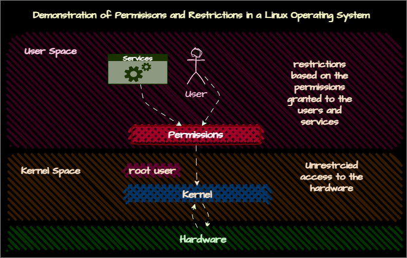

# User, Groups and Permissions
- [User and Groups](users.md)
- [Permissions Management](perm.md)

# User & Group Management
## Detailed Notes
- [User and Group Management](/2-usergrouppermissions/1-usergrmgmt/users.md)
## Summary

## Permissions
example:
```
 -rw-r--r--
```
- first character: file type
- next section: owner permissions
- next section: group permissions
- next section: other permissions
- ```r``` = read, ```w``` = write, ```x``` = execute

## User & Group Management Summary

| Command                              | Description                                           |
|--------------------------------------|-------------------------------------------------------|
| `id`             | Displays user ID, group ID, and group memberships. |
| `groups`         | Displays group memberships for the current user.   |
| `uid`       | Unique identifier for the user.                  |
| `gid`       | Primary group identifier for the user.           |
| Permissions | File access rights for owner, group, and others. |
| `sudo useradd -m -s /bin/bash newuser` | Create a new user with a home directory and default shell. |
| `sudo passwd newuser`                | Set the password for the new user.                    |
| `grep newuser /etc/passwd`           | Check user info in passwd           |
| `useradd -D`                         | Get an overview of currently effective default settings. |
| `sudo userdel -rf newuser`           | Delete a user and remove their home directory and mail spool. |
| `sudo groupadd newgroup`             | Create a new group.                                   |
| `sudo usermod -aG newgroup newuser`  | Add a user to a group.                                |
| `grep newgroup /etc/group`           | Check group details.                                  |
| `groupdel newgroup`                  | Delete a group.                                       |
| `groupmod -n newgroup2 newgroup`     | Change the group name.                                |
| `groupmod -p newpassword newgroup2`  | Change the group password.                            |

### Properties for `useradd` using ``useradd -D``

| Setting            | Description                                           |
|--------------------|-------------------------------------------------------|
| `GROUP`            | Default group ID                                      |
| `HOME`             | Default home directory                                |
| `INACTIVE`         | Number of days after the password expires             |
| `EXPIRE`           | Date when the account expires                         |
| `SHELL`            | Default shell                                         |
| `SKEL`             | Directory containing default files                    |
| `CREATE_MAIL_SPOOL`| Whether to create a mail spool file                   |

### Managing Users and Groups Properties
| Property       | Description                                      |
|----------------|--------------------------------------------------|
| `uid`          | User ID                                          |
| `gid`          | Group ID (primary group)                         |
| `gecos`        | User information, comments (optional)            |
| `home`         | Home directory                                   |
| `shell`        | Default shell (bash, zsh, etc.)                  |
| `getent passwd username` | View user properties in `/etc/passwd` file |
| `/etc/shadow`  | File where passwords are stored                  |
| `vipw`         | Edit `/etc/passwd` and `/etc/shadow` files directly |
| `/etc/group`   | File where group properties are stored           |
| `vigr`         | Edit `/etc/group` and `/etc/gshadow` files directly |
| `useradd -D`           | Get overview of currently effective default settings |
| `/etc/login.defs`      | Default settings for `useradd` and `usermod` commands |
| `/etc/skel`            | Default files copied to new user's home directory |

### `/etc/passwd` File Fields
  
 ``username:password:uid:gid:gecos:home:shell``
| Field          | Description                                      |
|----------------|--------------------------------------------------|
| `username`     | User name                                        |
| `password`     | Password (x means stored in `/etc/shadow`)       |
| `uid`          | User ID                                          |
| `gid`          | Group ID                                         |
| `gecos`        | User information                                 |
| `home`         | Home directory                                   |
| `shell`        | Default shell                                    |


example:
```
userex:x:1001:1001::/home/userex:/bin/bash
```

## Managing Passwords
| Command                              | Description                                           |
|--------------------------------------|-------------------------------------------------------|
| `passwd`                            | Change your password.                                 |
| `passwd username`                   | Change another user's password.                       |
| `passwd -S username`                | View password properties                              |
| `chage -l username`                 | View password expiration information.                  |
| `chage username`                    | Change password expiration information.                |

- changing password non-interactively

- `echo "newpassword" | sudo passwd --stdin username` Change password non-interactively. In Redhat 
- `echo "username:newpassword" | chpasswd` Change password non-interactively. In Debian

## Session Management Summary

| Command                          | Description                                      |
|----------------------------------|--------------------------------------------------|
| `who`                            | See the users currently logged in.               |
| `w`                              | See the users currently logged in.               |
| `loginctl`                       | Manage user sessions.                            |
| `loginctl list-sessions`         | List all the sessions.                           |
| `loginctl show-session sessionID`| Show the details of a specific session.          |
| `loginctl terminate-session sessionID` | Terminate a specific session.            |
| `loginctl show-user username`    | Show the details of a specific user.             |
| `loginctl kill-user username`    | Terminate all the sessions of a specific user.   |

# Permissions and Ownership Management in Linux
## Detailed Notes
- [Permissions and Ownership Management](/2-usergrouppermissions/2-permmgmt/perm.md)
## Review
- ```ls -l``` command is used to list files and directories in a long format.
- `u` (User), `g` (Group), and `o` (Others)
- ``+`` (Add), ``-`` (Remove), and ``=`` (Set)
- ``chmod`` command is used to change file permissions.
- ``chown`` command is used to change file ownership.
- ``chgrp`` command is used to change file group ownership.
- ``umask`` command is used to substract permissions from the default permissions.
### Basic Linux Permissions
| Permission | Description | Octal Value | Symbol |
| --- | --- | --- | --- |
| r | Read | 4 | r-- |
| w | Write | 2 | -w- |
| x | Execute | 1 | --x |
| - | No Permission | 0 | --- |

### Examples
- ``chmod u+x file``: add execute permission to user
- ``chmod g-w file``: remove write permission from group
- ``chmod o=r file``: set read permission to others
- ``chmod a=rwx file``: set read, write, execute permission to all
- ``chmod 777 file``: set read, write, execute permission to all
**basically ``chmod <u><g><o> <file>`` where ``<u>``, ``<g>``, ``<o>`` are 3 digit numbers where each digit represents the permission for user, group and others respectively.**
- ``chmod 755 file``: set read, write, execute permission to user and read, execute permission to group and others.
- ``chmod 644 file``: set read, write permission to user and read permission to group and others.
- ``chmod 744 file``: set read, write, execute permission to user and read permission to group and others.
- ```chmod 750 file```: set read, write, execute permission to user and read permission to group.

- ``chown parham:hosting_team /etc/nginx/nginx.conf``: change the ownership of the file to user parham and group hosting_team
    - usage: ``chown <user>:<group> <file>`` 
- example: ``chgrp hosting_team /etc/nginx/nginx.conf``: change the group ownership of the file to hosting_team
   -  usage: ``chgrp <group> <file>``
### Advanced Linux Permissions
| Feature       | Command                | Description                                                                 |
|---------------|------------------------|-----------------------------------------------------------------------------|
| **Set User ID (SUID)** | `chmod u+s file`       | Lets the user run as the user-owner of the file.                             |
|               | `chmod u-s file`       | Remove SUID.                                                                |
| **Set Group ID (SGID)** | `chmod g+s file`       | Lets the user run as the group-owner of the file.                            |
| **Sticky Bit** | `chmod +t directory`   | Only user-owner of the file or directory can delete files in the directory.  |
|               | `chmod -t directory`   | Remove sticky bit.                                                          |

#### Monitoring SUID and SGID Permissions

| Command                                | Description                                      |
|----------------------------------------|--------------------------------------------------|
| `sudo find / -type f -perm /6000 -ls`  | Find files with either SUID or SGID set (or both).|
| `sudo find / -type f -perm /4000 -ls`  | Find files with SUID set.                        |
| `sudo find / -type f -perm /2000 -ls`  | Find files with SGID set.                        |
| `sudo find / -type d -perm /1000 -ls`  | Find directories with Sticky Bit set.            |
### ``umask``
**Note: ``umask`` only deducts the permissions from the default permissions.**
| ``umask`` value octal | File Permission (-) |Description| Directory Permission (d) | Description |
|-------|-----------------|----|----------------------|-------------|
|**0** | **6 (-rw-)** | **No Execution (Default for a File Permission)** | **7 (drwx)** | **All Permissions (Default Directory Permission)** |
|**1** | **5 (-r-x)** | **No Write Permission** | 6 (drw-) | No Execution (not able to ``cd``) |
| **2** | **4 (-r--)** | **Only Read Permission** | **5 (dr-x)** | **No Write Permission** |
| **3** | 3 (--wx) | No Read Permission | **4 (d-r-)** | **Only Read Permission** |
| **4** | 2 (--w-) | Only Write Permission | 3 (d-wx) | No Read Permission |
| **5** | **1 (-x--)** | **Only Execution Permission** | 2 (d-w-) | Only Write Permission |
| **6** | **0 (---)** | **No Read, Write, and Execute Permission** | 1 (d--x) | Only Execution Permission |
| **7** | Not Relevant | Not Relevant | **0 (d---)** | **No Read, Write, and Execute Permission** |
#### Examples
| ``umask`` value | File Permission | Directory Permission | Description |
|-----------------|-----------------|----------------------|--|
| 022 | 644 | 755 | File: ``-rw-r--r--`` Directory: ``drwxr-xr-x`` |
| 027 | 640 | 750 | File: ``-rw-r-----`` Directory: ``drwxr-x---`` |
| 077 | 600 | 700 | File: ``-rw-------`` Directory: ``drwx------`` |
| 122 | 544 | 655 | File: ``-r-xr--r--`` Directory: ``drw-r-xr-x`` |
#### Best Method to Calculate ``umask`` 


