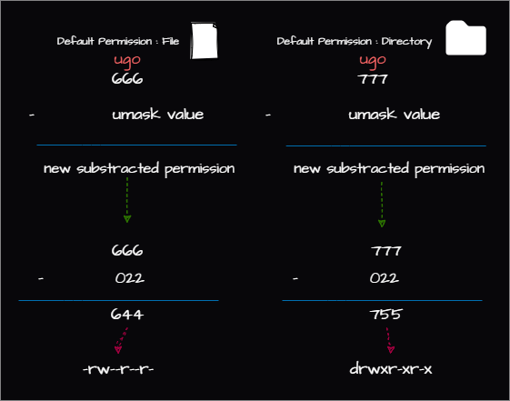

# Permissions and Ownership in Linux
## ``ls -l`` command
- ``ls -l`` command is used to list the files and directories in a directory with detailed information about the files and directories.
  
## Basic Permissions
- **r**: read permission
- **w**: write permission
- **x**: execute permission
- **-**: no permission

### ``r``,``w``,``x`` permissions in files and directories
- **r**: read permission
  - file: read the content of the file
  - directory: list the content of the directory
  - example: ``cat file``, ``ls directory``

**Note: read permission on a directory does not mean that the content of the files in the directory can be read. It only means that the names of the files in the directory can be read.**
- **w**: write permission
  - file: modify the content of the file
  - directory: create, delete, rename files in the directory
  - example: ``echo "content" > file``, ``touch file``, ``rm file``
**Note: write permission on a directory does not mean that the content of the files in the directory can be modified. It only means that the names of the files in the directory can be modified. Files can be created or deleted**
**Note: deleting a file is a write operation on the directory containing the file, so no permission is required on the file itself to delete it.**

- **x**: execute permission
  - file: execute the file
  - directory: access the content of the directory
  - example: ``./file``, ``cd directory``
**Note: execute permission on a directory does not mean that the content of the files in the directory can be executed. It only means that the directory can be accessed.**
### ``chmod`` command
- ``chmod`` command is used to change the permissions of a file or directory.
#### ``u``, ``g``, ``o``
- ``u``: user
- ``g``: group
- ``o``: others

#### ``+``, ``-``, ``=``
- ``+``: add permission
- ``-``: remove permission
- ``=``: set permission

##### Examples
- ``chmod u+x file``: add execute permission to user
- ``chmod g-w file``: remove write permission from group
- ``chmod o=r file``: set read permission to others
- ``chmod a=rwx file``: set read, write, execute permission to all

#### octal mode
| Octal | Binary | Permission |
|-------|--------|------------|
| **0** | **000** | **---** |
| **1** | **001** | **--x** |
| **2** | **010** | **-w-** |
| 3 | 011 | -wx |
| **4** | **100** | **r--** |
| **5** | **101** | **r-x** |
| **6** | **110** | **rw-** |
| **7** | **111** | **rwx** |


##### Examples
basically ``chmod <u><g><o> <file>`` where ``<u>``, ``<g>``, ``<o>`` are 3 digit numbers where each digit represents the permission for user, group and others respectively. 
- ``chmod 755 file``: set read, write, execute permission to user and read, execute permission to group and others.
- ``chmod 644 file``: set read, write permission to user and read permission to group and others.
- ``chmod 744 file``: set read, write, execute permission to user and read permission to group and others.
- ```chmod 750 file```: set read, write, execute permission to user and read permission to group.

### Ownership
- **Ownership by Default**: the user-owner who created the file (by default), the group-owner is the primary group of the user-owner and the others-owner is everyone else.
- **Standard Linux File Permissions**: only allows for one user-owner, one group-owner. 

#### ``chown`` command
- ``chown`` command is used to change the ownership of a file or directory.
- usage: ``chown <user>:<group> <file>``
##### Examples
- ``chown parham:hosting_team /etc/nginx/nginx.conf``: change the ownership of the file to user parham and group hosting_team

#### ``chgrp`` command
- ``chgrp`` command is used to change the group ownership of a file or directory.
- usage: ``chgrp <group> <file>``
- example: ``chgrp hosting_team /etc/nginx/nginx.conf``: change the group ownership of the file to hosting_team

### Demo for Basic Permissions and Ownership
- we have file in ``/tmp/data/hosting/file``. We want to view its permissions and ownership.
```bash
ls -l /tmp/data/hosting/file
```
```
-rw-r--r-- 1 USER hosting 0 Sep 18 12:56 /tmp/data/hosting/file
```
- we see that the file has 
    - read and write permission for user ``rw-``
    - read permission for group ``r--``
    - read permission for others ``r--``
    - user-owner is ``USER``
    - group-owner is ``hosting``
    - others-owner is everyone else

- Now we want to give the user-owner execute permission and the group owner write permission and omit read permission for others.
```bash
chmod 760 /tmp/data/hosting/file
```
now let's check the permissions
```bash
ls -l /tmp/data/hosting/file
```
```
-rwxrw---- 1 USER hosting 0 Sep 18 12:56 /tmp/data/hosting/file
```
- we see that the file has 
    - read, write and execute permission for user ``rwx``
    - read and write permission for group ``rw-``
    - no permission for others ``---``
    - user-owner is ``USER``
    - group-owner is ``hosting``
    - others-owner is everyone else

- now we want to change the group ownership of the file to ``cloud-migration``
```bash
chgrp cloud-migration /tmp/data/hosting/file
```
now let's check the permissions
```bash
ls -l /tmp/data/hosting/file
```
```
-rwxrw---- 1 USER cloud-migration 0 Sep 18 12:56 /tmp/data/hosting/file
```
- we see that the file has 
    - read, write and execute permission for user ``rwx``
    - read and write permission for group ``rw-``
    - no permission for others ``---``
    - user-owner is ``USER``
    - group-owner is ``cloud-migration``
    - others-owner is everyone else

- now we want to change the ownership of the file to ``cloud-migration`` and group ownership to ``hosting``
```bash
chown cloud-migration:hosting /tmp/data/hosting/file
```
now let's check the permissions
```bash
ls -l /tmp/data/hosting/file
```
```
-rwxrw---- 1 cloud-migration hosting 0 Sep 18 12:56 /tmp/data/hosting/file
```
- we see that the file has 
    - read, write and execute permission for *``cloud-migration``* ``rwx``
    - read and write permission for group *``hosting``* ``rw-``
    - no permission for others ``---``
    - user-owner is *``cloud-migration``*
    - group-owner is *``hosting``*
    - others-owner is everyone else

## Advanced Linux Permissions
- **Set User ID - SUID**: set user ID
    - when on a file it runs as the user-owner of the file
- **Set Group ID - SGID**: set group ID
    - when on a file it runs as the group-owner of the file
    - when on a directory, files created (newly created after the command) in the directory inherit the group-owner of the directory
- **Sticky Bit**: when on a directory, it aloows the user-owner of the file or the user-owner of the directory to delete the files in the directory

### Usage in ``chmod`` command
- **Set User ID - SUID**: ``chmod u+s file``
    - lets the user run as the user-owner of the file 
    - ``u-s``: remove SUID
    - ``u+s``: add SUID

- **Set Group ID - SGID**: ``chmod g+s file``
    - lets the user run as the group-owner of the file 

- **Sticky Bit**: ``chmod +t directory``
  - lets the only user-owner of the file or the user-owner of the directory to delete the files in the directory
  - ``-t``: remove sticky bit 
  - **Note**: sticky bit is not used in files but for directories. It prevents the deletion of files in the directory by anyone other than the user-owner of the file or the user-owner of the directory.

#### Monitoring SUID and SGID permissions
```bash
sudo find / -type f -perm /6000 -ls  # Files with SUID or SGID
sudo find / -type f -perm /4000 -ls  # Files with SUID
sudo find / -type f -perm /2000 -ls  # Files with SGID
sudo find / -type d -perm /1000 -ls  # Directories with Sticky Bit
```
- ``/6000`` : finds files with either SUID or SGID set (or both).
- ``/4000``: finds files with SUID set.
- ``/2000``: find files with SGID set.
- ``/1000``: finds directories with the sticky bit set.

###  ``umask`` 
Setting that defines a mask that restricts the default permissions for newly created files and directories.
#### Default Permissions
- **Files**: 666 (rw-rw-rw-)
- **Directories**: 777 (rwxrwxrwx)
#### ``umask`` values
#### `umask` values

#### `umask` Values and Their Effects
**Note: ``umask`` only deducts the permissions from the default permissions.**
| ``umask`` value octal | File Permission (-) |Description| Directory Permission (d) | Description |
|-------|-----------------|----|----------------------|-------------|
|**0** | **6 (-rw-)** | **No Execution (Default for a File Permission)** | **7 (drwx)** | **All Permissions (Default Directory Permission)** |
|**1** | **5 (-r-x)** | **No Write Permission** | 6 (drw-) | No Execution (not able to ``cd``) |
| **2** | **4 (-r--)** | **Only Read Permission** | **5 (dr-x)** | **No Write Permission** |
| **3** | 3 (--wx) | No Read Permission | **4 (d-r-)** | **Only Read Permission** |
| **4** | 2 (--w-) | Only Write Permission | 3 (d-wx) | No Read Permission |
| **5** | **1 (-x--)** | **Only Execution Permission** | 2 (d-w-) | Only Write Permission |
| **6** | **0 (---)** | **No Read, Write, and Execute Permission** | 1 (d--x) | Only Execution Permission |
| **7** | Not Relevant | Not Relevant | **0 (d---)** | **No Read, Write, and Execute Permission** |
##### Examples
| ``umask`` value | File Permission | Directory Permission | Description |
|-----------------|-----------------|----------------------|--|
| 022 | 644 | 755 | File: ``-rw-r--r--`` Directory: ``drwxr-xr-x`` |
| 027 | 640 | 750 | File: ``-rw-r-----`` Directory: ``drwxr-x---`` |
| 077 | 600 | 700 | File: ``-rw-------`` Directory: ``drwx------`` |
| 122 | 544 | 655 | File: ``-r-xr--r--`` Directory: ``drw-r-xr-x`` |
##### Best Method to Calculate ``umask`` 


##### Examples
- run ``umask`` command to see the default ``umask`` value
```bash	
umask
```
```
022
```
- the default ``umask`` value is ``022`` which means that the default permissions for files are ``644`` and for directories are ``755``. which is read, write and execute permission for user and read permission for group and others for files and read, write and execute permission for user and read and execute permission for group and others for directories.

- in ``/etc/skel/.bashrc`` file, add the following line to set the ``umask`` value to 002
so this way the user owner and the group owner have read, write and execute permissions on files and others have only read permissions on files. For directories, the user owner and the group owner have read, write and execute permissions and others have read and execute permissions (using ``cd`` and ``ls``)
```bash
umask 002
```

