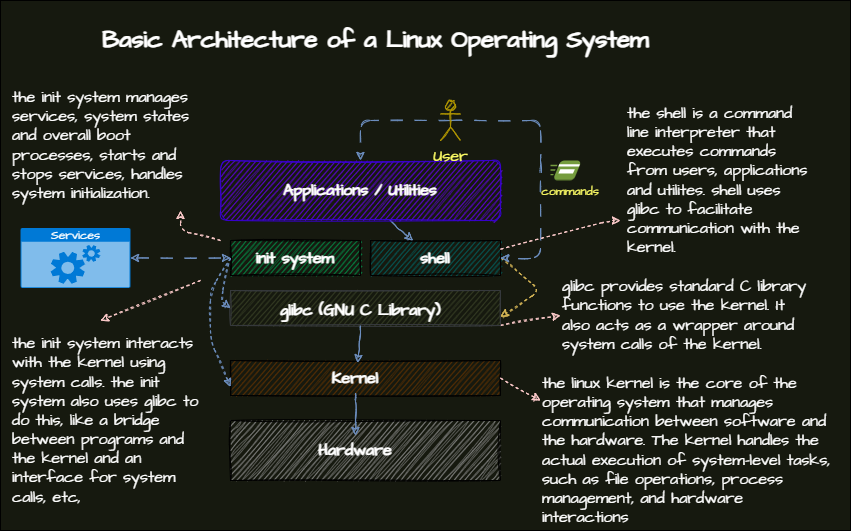

## Linux Introduction
### Detailed Notes
 - [Linux Introduction](/basics/1-FirstBasics.md/#linux-fundementals-notes)
  - [Essential Basic Commands](/basics/1-FirstBasics.md/#essential-basic-commands)
  - [Navigating through Files and Directories](/basics/README.md/#essential-file-management)
  - [Using manuals and ``--help``](/basics/1-FirstBasics.md/#getting-help-with-man)
  - [Linux File Systems](/basics/1-basics/3-LinuxFileSystems.md)
  - [Bash Shell](/basics/6-bash/shell.md)
  - [Summary](/basics/README.md)

##### Basic Commands

| Command       | Description                                      |
|---------------|--------------------------------------------------|
| `ls`          | List directory contents                          |
| `pwd`         | Print working directory                          |
| `cd`          | Change directory                                 |
| `cp`          | Copy files and directories                       |
| `mv`          | Move files and directories                       |
| `cat`         | Concatenate and display files                    |
| `touch`       | Create an empty file                             |
| `rm`          | Remove files or directories                      |
| `mkdir`       | Make directories                                 |
| `rmdir`       | Remove empty directories                         |
| `chmod`       | Change file permissions                          |
| `chown`       | Change file owner and group                      |
| `ps`          | Process status                                   |
| `top`         | Display and update sorted information about processes |
| `history`     | Display the history of commands                  |
| `clear`       | Clear the terminal screen                        |
| `date`        | Display the current date and time                |
| `whoami`      | Display the current user                         |
| `su`          | Switch user                                      |
| `sudo`        | Execute a command as another user                |
| `passwd`      | Change a user's password                         |
| `appropos`    | Search the manual page names and descriptions    |
| `mandb`       | Create or update the manual page index cache     |
| `pinfo`       | Display the documentation for a command or a program |
| `sudo su`     | Change user to root user                         |
| `su [username]` | Change user to another user                    |

### Getting Help with man

- ``man`` -> Systems Programmer's Manual
  e.g. `man ls` will display the manual for the `ls` command.

  In manuals where the options or commands are in brackets, it means they are optional.

- ``man man`` -> Manual for the manual command

  e.g. `man man` will display the manual for the `man` command.

- **which man Page to use**:

  - Man pages are stored in `mandb`.
  - `man -k <keyword>` to search for a keyword in `mandb`.

    e.g. `man -k user` will search for the keyword `user` in the manual pages.

  - `man apropos` - Search the manual page names and descriptions.

  - ``mandb`` - Create or update the manual page index cache.

    When the `mandb` wasn't updated by the cronjob, you can update it manually by running the `mandb` command. You'll need sudo privileges to run this command.

  - Using pipes with `man`:

    - `man -k user | grep -i user` - This will search for the keyword `user` in the manual pages and then pipe the output to `grep` to search for the keyword `user` in the output. `grep` is a command-line utility for searching plain-text data sets for lines that match a regular expression. The `-i` flag is used to ignore case distinctions in both the PATTERN and the input files.

    - `man -k user | less` - This will search for the keyword `user` in the manual pages and then pipe the output to `less`. `less` is a command-line utility that displays the contents of a file or a command output one page at a time in your terminal.

## Bash
### Linux Basic Architecture

### Redirection and Piping
#### Redirection
- ``>``, ``>>``: Redirects output to a file. ``>`` overwrites the file, ``>>`` appends to the file.
- Standard error is redirected with ``2>`` or also ``&>``. The latter redirects both standard output and standard error.
#### Piping
- used to send the output of one command to another command.
```bash
ps aux | grep http
ls -l | grep myfile | less
```
##### ``tee``	
- is used to combine the redirection and piping.
```bash
ls -l | tee file.txt | less
ps aux | tee psfile | grep ssh
```
### ``history`` 
-  ``history`` command shows the history of commands. written to ``~/.bash_history``.
#### Command Options

| Option    | Description                              |
|-----------|------------------------------------------|
| `-c`      | Clears the history.                      |
| `-w`      | Writes the history to the file.          |
| `-r`      | Reads the history from the file.         |
| `-d`      | Deletes a specific line from the history.|
| `-a`      | Appends the history to the file.         |
| `CTRL+R`  | Search the history.                      |
| `!n`      | Executes the command number `n`.         |
##### Command Line Completion
- ``TAB`` key can be used to complete the command or filename.
- Some packages can be used for better auto-completion. See [here](misc\zsh-autocompleting.md)
#### Variables and Environment Variables
## Summary Table

### Variables and Environment Variables

| Topic                     | Description                                                                 |
|---------------------------|-----------------------------------------------------------------------------|
| Set a variable and print | `MYVAR=hello`<br>`echo $MYVAR`                                              |
| Exporting Variables  | Make variables available to other shells.<br>Example: `export MYVAR=hello`<br>`echo $MYVAR` |
| View Environment Variables| Use the `env` command to see environment variables.                    |

#### Important Environment Variables

| Variable | Description                                      |
|----------|--------------------------------------------------|
| `PATH`   | Directories where the shell looks for commands.  |
| `HOME`   | Home directory of the user.                      |
| `PWD`    | Current working directory.                       |
| `USER`   | Username of the user.                            |
| `SHELL`  | Shell that is being used.                        |
| `EDITOR` | Default editor.                                  |
| `LANG`   | Language settings.                               |
| `TERM`   | Terminal type.                                   |
| `PS1`    | Prompt settings.                                 |

### Other Bash Features
## Summary Tables

### Aliases

| Command       | Description                          |
|---------------|--------------------------------------|
| `alias`       | Create shortcuts for commands.       |
| `unalias`     | Remove an alias.                     |
|   `alias <alias-name>='<the command>'` | making an alias for a command |


### Shortcuts

| Shortcut | Description                          |
|----------|--------------------------------------|
| `CTRL+C` | Interrupts the current process.      |
| `CTRL+Z` | Stops the current process.           |
| `CTRL+D` | Logs out of the current shell.       |
| `CTRL+L` | Clears the screen.                   |
| `CTRL+A` | Moves the cursor to the beginning of the line. |
| `CTRL+E` | Moves the cursor to the end of the line. |
| `CTRL+U` | Deletes the line before the cursor.  |
| `CTRL+K` | Deletes the line after the cursor.   |

### Bash Startup Files

| File                  | Description                          |
|-----------------------|--------------------------------------|
| `/etc/profile`        | System-wide settings.                |
| `/etc/profile.d/`     | Additional settings.                 |
| `/etc/bashrc`         | System-wide bash settings.           |
| `~/.bashrc`           | User-specific bash settings.         |
| `~/.bash_profile`     | User-specific settings.              |
| `~/.bash_logout`      | User-specific settings when logging out. |
| `/etc/environment`    | System-wide environment settings.    |