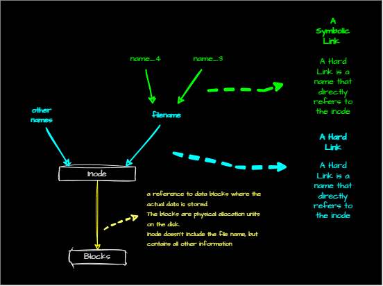

# Understanding Hard Links and Symbolic Links

## inodes

- Every file in linuxsystems has an inode. The inode contains complete information about the file , the only thing that is not stored in inode is the file name. From the inode a reference is made to data blocks where the actual data is stored. The blocks are physical allocation units on the disk.
  


- The difference between hard links and symbolic links is:
  - Hard links are sitting directly on the inode, so there are no dependencies on the hard link. The only thing about hard link is it needs to be on the same file system.
  - Cross-device hard links are not possible.
  - With hard links you cna't link directories.
  - If the file is deleted, the soft link will be broken and invalid.
  
## Examples
Let's say we have a shell script that has to be executed in different dircotorie, Or we have a same configurations file that should on 5 different places. Instead of copying the file to 5 different places, we can create a hard link to the file. And then the changes made to the file will be reflected in all the hard links.

### Hard Link Example
#### how to create a hard link
For example let's copy the hosts file from /etc/hosts to /tmp/hosts
```bash
cd /tmp/hosts
cp /etc/hosts .
ls -li hosts
```
the `-i` option will show the inode number of the file.
```
9201812 -rw-r--r--. 2 user user 155 Aug 24 16:46 hosts
```

Let's make a hard link to the file
```bash
ln hosts hosts_hardlink
ls -li hosts hosts_hardlink
```
The inode number of the hard link will be the same as the original file. If we make changes to the original file, the changes will be reflected in the hard link as well.
```
9201812 -rw-r--r--. 2 user user 155 Aug 21 16:46 hosts
9201812 -rw-r--r--. 2 user user 155 Aug 21 16:46 hosts_hardlink
```
#### changing the original file and see the changes in the hard link

let's now change something in the original file and see if the changes are reflected in the hard link.
```bash
echo hello >> hosts
cat hosts_hardlink
```
***output:***
```
127.0.0.1 user localhost.localdomain localhost4 localhost4.localdomain4 ::1 localhost localhost.localdomain localhost6 localhost6.localdomain6 hello
``` 
The changes are reflected in the hard link as well.

### Symbolic Link Example
#### how to create a symbolic link
Now let's create a symbolic link to the file.
```bash
ln -s hosts hosts_symlink
ls -li hosts hosts_hardlink hosts_symlink
```
```
9201812 -rw-r--r--. 2 user user 161 Aug 21 17:43 hosts
9201812 -rw-r--r--. 2 user user 161 Aug 21 17:43 hosts_hardlink	
9201818 lrwxrwxrwx. 1 user user   5 Aug 21 17:48 hosts_symlink -> hosts
```	
The inode number of the symbolic link is different from the original file. The symbolic links has only 5 bytes, which is the length of the file name, since it only contains the path to the file.

#### changing the path of symbolic link and see the changes in the symbolic link
Let's now change the path of the symbolic link and see if the link is still valid.
```bash
mkdir test
mv hosts_symlink test
ls -li test/hosts_symlink
```
```
9201818 lrwxrwxrwx. 1 user user 5 Aug 21 17:48 test/hosts_symlink -> hosts
```
The link is not valid. The hosts_symlink -> hosts is in red color, which means the link is broken. if you
```bash	
cat test/hosts_symlink
```
```
cat: test/hosts_symlink: No such file or directory
```
you will see the file is not found. The symlink only contains the file name, so if the symlink is moved to a different directory, it will look for the file in the same directory which hosts is not found anymore. 

#### moving the original file and see the changes in the symbolic link
Now let's move the symlink back to tmp folder and move the original file to /home and see if the symbolic link is still valid.
```bash
mv test/hosts_symlink .
sudo mv hosts /home
ls -li hosts hosts_hardlink hosts_symlink
```
```
9201812 -rw-r--r--. 2 user user 161 Aug 21 17:43 hosts_hardlink
9201818 lrwxrwxrwx. 1 user user   5 Aug 21 17:48 hosts_symlink -> hosts
```
The symbolic link is broken as we can see 
```bash
cat hosts_symlink
```
```
cat: hosts_symlink: No such file or directory
```
##### what about the hard link?
The hard link is still valid, since the hard link is directly on the inode, so it doesn't matter where the file is moved. But the symlink only contains the file name, so if the original file is moved, the symlink will be searching for it in the former location which hosts is not found anymore. 

when we roll back the changes, the symlink will be valid again.
```bash
sudo mv /home/hosts .
ls -li hosts hosts_hardlink hosts_symlink
```
```
9201812 -rw-r--r--. 2 user user 161 Aug 21 17:43 hosts
9201812 -rw-r--r--. 2 user user 161 Aug 21 17:43 hosts_hardlink
9201818 lrwxrwxrwx. 1 user user   5 Aug 21 17:48 hosts_symlink -> hosts
```
The symlink is valid again. because
```bash
cat hosts_symlink
```
***output:***
```
127.0.0.1 user localhost.localdomain localhost4 localhost4.localdomain4 ::1 localhost localhost.localdomain localhost6 localhost6.localdomain6 hello
```
#### real world example of a symbolic link --> ``bin >> /usr/bin``

After changes in linux file structure, the bin directory was moved to /usr/bin. To make sure the old scripts that were pointing to /bin are still valid, a symbolic link was created from /bin to /usr/bin. So if you do
```bash
ls -li /bin
```
```
113608 lrwxrwxrwx. 1 root root 7 Jun 25 16:23 /bin -> usr/bin
```
you see the bin is a symbolic link to /usr/bin

## Cheat Sheet
| Command | Description | Example |
| --- | --- | --- |
| `ln` | create a hard link to a file `ln <target> <link_name>` | `ln hosts hosts_hardlink` |
| `ln -s` | create a symbolic link to a file `ln -s <target> <link_name>` | `ln -s hosts hosts_symlink` |
| `ls -li` | list files with inode number | `ls -li hosts hosts_hardlink hosts_symlink` |
