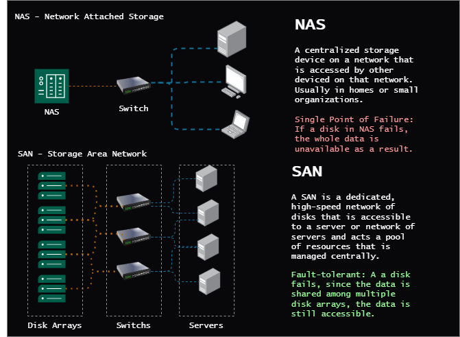
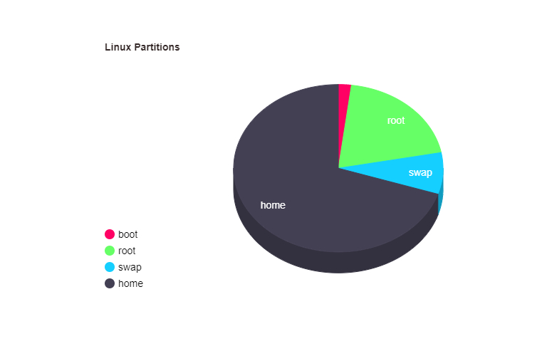

# File Management
This section covers the file management tasks in linux. 
### Detailed Notes
  - [Essential File Management](/1-linux-fundementals/2-file-management/4-EssentialFileManagement.md)
  - [Using ``find``](/1-linux-fundementals/2-file-management/6-usingFind.md)
  - [Archiving](/1-linux-fundementals/2-file-management/7-archiving.md) 
  - [Mounting File Systems](/1-linux-fundementals/2-file-management/8-mountfilesys.md)
  - [Storage](/1-linux-fundementals/2-file-management/storage.md)
  - Examples
      - [Basic File Management Examples](/1-linux-fundementals/2-file-management/basic-file-mgmt-examples.md)
      - [More Advanced File Management Examples](/1-linux-fundementals/2-file-management/example-advflmgmt.md)
### TL;DR
##### Essential File Management

###### cp - Copy files and directories

| Command                                      | Description                                                                 |
|----------------------------------------------|-----------------------------------------------------------------------------|
| `cp /dir/myfile /mydirectory`                | Copy the file to `/mydirectory` which is already created                    |
| `cp -a ~/.* /tmp/`                           | Copy all hidden files and directories from the home directory to `/tmp/`    |
| `cp -r /dir /mydirectory`                    | Copy the directory to `/mydirectory` including all subdirectories and files |
| `cp /etc/passwd /home/.userdata/`            | Copy the passwd file to the .userdata directory in the home directory       |
| `cp -rfv /dir /mydirectory`                  | Copy the directory `/dir` to `/mydirectory` recursively, forcefully, and verbosely |
| `-a` or `--archive`                          | Same as `-dR --preserve=all`                                                |
| `-b` or `--backup`                           | Make a backup of each existing destination file                             |
| `-f` or `--force`                            | Remove without confirmation and asking questions                            |
| `-r` or `--recursive`                        | Copy directories recursively                                                |
| `-p` or `--preserve`                         | Preserve the specified attributes                                           |
| `-v` or `--verbose`                          | Explain what is being done                                                  |

###### mv - Move files and directories

| Command                                      | Description                                                                 |
|----------------------------------------------|-----------------------------------------------------------------------------|
| `mv /dir/myfile /mydirectory`                | Move the file to `/mydirectory` which is already created                    |
| `mv .* /mydirectory`                         | Move all hidden files and directories                                       |
| `-b` or `--backup`                           | Make a backup of each existing destination file                             |
| `-f` or `--force`                            | Remove without confirmation and asking questions                            |
| `-v` or `--verbose`                          | Explain what is being done                                                  |
| `-i` or `--interactive`                      | Prompt before overwriting                                                   |
| `-u` or `--update`                           | Move when the source is newer than the destination                          |

###### rm - Remove files or directories

| Command                                      | Description                                                                 |
|----------------------------------------------|-----------------------------------------------------------------------------|
| `rm /dir/myfile`                             | Remove the file                                                             |
| `rm -r /dir`                                 | Remove the directory and all its contents                                   |
| `rm .*`                                      | Remove all hidden files and directories                                     |
| `-r` or `--recursive`                        | Remove directories and their contents recursively                           |
| `-f` or `--force`                            | Ignore nonexistent files and arguments, never prompt                        |
| `-v` or `--verbose`                          | Explain what is being done                                                  |
| `-i` or `--interactive`                      | Prompt before every removal or `-I` for less intrusive version of `-i`      |
| `-d` or `--dir`                              | Remove empty directories                                                    |
| `rm -rf / --no-preserve-root`                | Remove all files and directories in the root directory (dangerous command)  |

###### touch - Create an empty file

| Command                                      | Description                                                                 |
|----------------------------------------------|-----------------------------------------------------------------------------|
| `touch file.txt`                             | Create an empty file called `file.txt`                                      |
| `touch /tmp/file.txt`                        | Create file `file.txt` in the `/tmp` directory                              |
| `touch .file.txt`                            | Create a hidden file called `.file.txt`                                     |
| `-t` STAMP                                   | Use the specified time instead of the current time                          |
| `-d` or `--date` STRING                      | Parse STRING and use it instead of the current time                         |

###### mkdir - Make directories

| Command                                      | Description                                                                 |
|----------------------------------------------|-----------------------------------------------------------------------------|
| `mkdir /tmp/test`                            | Create a directory called `test` in the `/tmp` directory                    |
| `-p` or `--parents`                          | No error if existing, make parent directories as needed                     |
| `-v` or `--verbose`                          | Explain what is being done                                                  |

###### rmdir - Remove empty directories

| Command                                      | Description                                                                 |
|----------------------------------------------|-----------------------------------------------------------------------------|
| `rmdir /tmp/test`                            | Remove the empty directory `test` in the `/tmp` directory                   |
| `-p` or `--parents`                          | Remove parent directories if they are empty                                 |
| `-v` or `--verbose`                          | Explain what is being done                                                  |

###### ls - List directory contents

| Command                                      | Description                                                                 |
|----------------------------------------------|-----------------------------------------------------------------------------|
| `ls -l`                                      | Long listing format (many details about the files)                          |
| `ls -a`                                      | List all files including hidden files                                       |
| `ls -lh`                                     | List files in long listing format with human-readable file sizes            |
| `ls -ld`                                     | List files in long listing format with human-readable file sizes and sort by date |
| `ls -lrt`                                    | Shows a time-sorted list of files                                           |
| `ls -la`                                     | List all files including hidden files in long listing format                |
| `ls -d b*`                                   | List all directories that start with `b`                                    |

##### Using Wildcards

| Command                                      | Description                                                                 |
|----------------------------------------------|-----------------------------------------------------------------------------|
| `ls a*`                                      | List all files that start with `a`                                          |
| `ls a?*`                                     | List all files that start with `a` and have at least one character after `a`|
| `ls a[bc]*`                                  | List all files that start with `a` and have `b` or `c` as the second character |
| `ls a[^bc]*`                                 | List all files that start with `a` and have any character other than `b` or `c` as the second character |
| `ls a[a-e]*`                                 | List all files that start with `a` and have `a`, `b`, `c`, `d`, or `e` as the second character |
| `touch a{1..5}`                              | Create files `a1`, `a2`, `a3`, `a4`, and `a5`                               |
| `mkdir /data/{sales,marketing,hr}`           | Create directories `sales`, `marketing`, and `hr` in `/data` directory      |
| `ls -d [ab]????`                             | List all files that start with `a` or `b` and have 4 characters after `a` or `b` |
| `touch file_{1..5}.txt`                      | Create files `file_1.txt`, `file_2.txt`, `file_3.txt`, `file_4.txt`, and `file_5.txt` |
| `rm file_{1..5}.txt`                         | Remove files `file_1.txt`, `file_2.txt`, `file_3.txt`, `file_4.txt`, and `file_5.txt` |
| `.[!.]*`                                     | Exclude `.` and `..` directories when working with hidden files and directories |

##### Relative and Absolute Paths

| Path Type       | Description                                                                 |
|-----------------|-----------------------------------------------------------------------------|
| **Relative Path** | Path relative to the current directory                                    |
| `cd /var/log`   | Change the directory to `/var/log`                                          |
| `cd ..`         | Change the directory to the parent directory                                |
| `cd ../..`      | Change the directory to the parent of the parent directory                  |
| `cd ~`          | Change the directory to the home directory                                  |
| `cd -`          | Change the directory to the previous directory                              |
| **Absolute Path** | Path relative to the root directory                                       |
| `cd /var/log`   | Change the directory to `/var/log`                                          |
| `cd /`          | Change the directory to the root directory                                  |
| `cd /root`      | Change the directory to the root user home directory                        |

#### Hard links and Symbolic Links
| Command | Description | Example |
| --- | --- | --- |
| `ln` | create a hard link to a file `ln <target> <link_name>` | `ln hosts hosts_hardlink` |
| `ln -s` | create a symbolic link to a file `ln -s <target> <link_name>` | `ln -s hosts hosts_symlink` |
| `ls -li` | list files with inode number | `ls -li hosts hosts_hardlink hosts_symlink` |
#### Searching files and directories
##### `find`
| Command | Description |
|---------|-------------|
| `find /path/to/search -user username` | Find files owned by a specific user. |
| `find /path/to/search -name "filename"` | Find files by name. |
| `find /path/to/search -size +1M` | size-based. Find files larger than 1MB in the path |
| `find /path/to/search -perm /4000` | permission based. Find files with setuid permission. |
###### Advanced Usage of `find`

| Command | Description | Options Used |
|---------|-------------|--------------|
| `mkdir /tmp/test ; sudo find /home -size +2M -exec cp {} /tmp/test \;` | Create a directory `/tmp/test`, find files larger than 2MB in `/home`, and copy them to `/tmp/test`. | `-exec` |
| `sudo find / -type f -size +5M` | Find files larger than 5MB in the root directory, only searching for files. | Combination of `-type` and `-size` |
| `sudo find /etc -type f -exec grep -l "root" {} \;` | Find files in `/etc` containing the string "root". | Using `grep` with `find` |
| `sudo find /etc/ -name '*.conf' -type f -exec cp {} /tmp/test \;` | Find files in `/etc` ending with `.conf` and copy them to `/tmp/test`. | Using wildcards with `find` and `-exec` option |
| `sudo find /etc/ -name '*' -type f \| xargs grep "127.0.0.1" 2>/dev/null` | Find files in `/etc` and search for "127.0.0.1" within them, suppressing error messages. | Using `xargs` with `grep`, ignoring errors with `2>/dev/null` |
##### Others
| Command | Description |
|---------|-------------|
| `which` | Find the location of a command. |
| `locate` | Find files by name. |
| `updatedb` | Update the database used by `locate`. |

#### Archiving and Compression
##### compression utilities
| Command | Description |
|---------|-------------|
| `gzip` | Compress files. Fast but not the best compression |
|`bzip2` | Compress files. Slower but better compression |
| `xzip` | Compress files. Slowest but best compression |
##### `tar` Command cheat sheet
| Option | Description | Command |
|--------|-------------|---------|
| -cjvf | Create a new archive with bzip2 compression | `tar -cjvf archive.tar.bz2 file1 file2 file3` |
| -xjvf | Extract files from an archive with bzip2 compression | `tar -xjvf archive.tar.bz2` |
| -cJvf | Create a new archive with xzip compression | `tar -cJvf archive.tar.xz file1 file2 file3` |
| -xJf | Extract files from an archive with xzip compression | `tar -xJf archive.tar.xz` |
| --exclude | Exclude files and directories | `tar -cvf /tmp/archive.tar /home --exclude=/home/user/temp` |
| -rvf | Append files to an existing archive | `tar -rvf /tmp/archive.tar /home/user/test` |
| -dvf | Verify the archive | `tar -dvf /tmp/archive.tar` |
| --wildcards | Use wildcards | `tar -cvf archive.tar /home/*.txt` |
| -cvpf | Preserve permissions | `tar -cvpf archive.tar /home` |
| split | Split the archive | `tar -cvf - /home \| split -b 100M - /tmp/backup.tar.part_` |
| -g snapshot.file (or any other name like sn.snar) | Create a snapshot file | `tar -cvJf full-backup.tar.xz -g snapshot.file  /etc` |
| -uvf | Update the archive | `tar -uvf /tmp/full-backup.tar /etc` |
#### Mounting and Filesystems
| Command | Description |
|---------|-------------|
| `lsblk` | List all block devices. |
| `sudo umount /dev/<device-name>` | Unmount a device. |
| `sudo umount /path/to/mountpoint` | Unmount a device by specifying the mount point. |
|`sudo mkdir /path/to/mountpoint && sudo mount /dev/<device-name> /path/to/mountpoint` | Create a mount point and mount a device to a specific mount point. |
| `df -h` | Display disk space usage. Human-readable format |
| `findmnt` | Display mounted filesystems. Detailed |
| `mount` | List all current mounts. |

# Storage Management in Linux
A detailed note on storage management in Linux below:
- [Storage Management](/2-usergrouppermissions/3-storagemgmt/storage.md) - Understanding storage management, mounting, unmounting, etc.
- [A Comprehensive Demo of Partitioning and Mounting in Linux](/2-usergrouppermissions/3-storagemgmt/storage.md/#comprehensive-demo)

## Summary
### Storage in Linux
``/dev`` directory contains all devices in Linux. We address devices using the ``/dev`` directory as device files. These device files should be used to partition and format the storage devices and mount them to the file system in their mount points.
we have internal and external storage devices. Internal storage devices are hard drives, SSDs, etc. External storage devices are USB drives, external hard drives, NAS, SAN, etc.

#### NAS and SAN

### Linux Partitions

- **boot** : Contains the boot loader and kenrnel files for booting the system.
- **root** : Contains the root file system and practically where the operating system is installed.
- **swap** : Contains the swap space and acts as a overflow for the RAM when it is full.
- **home** : Contains the user's personal files and other data.
### File Systems
A file system is how the data is managed on the partition. The file system is responsible for indexing, storing, naming and retrieving the data on the partition.
| File System | Description |
|-------------|-------------|
| ***``ext4``*** | The default file system for most Linux distributions. |
| ***``xfs``*** | Used in enterprise environments. Mostly in RHEL |
| ``btrfs`` | Used in OpenSUSE |
| ``zfs`` | Used in Solaris and FreeBSD |
| ``ntfs`` | Used in Windows |
| ``fat32`` | Used in USB drives (older generation of file systems) |
| ``swapfs`` | Used for swap partitions |
| ``initramfs`` | Used for initial RAM file system |
| ``vfat`` | Used in boot partitions and mostly seen in wsl or dual boot systems. can be processed by both linux and windows | 

### LVM
- Logical Volume Management is a method of managing storage devices by grouping them into logical volumes.
- They are more useful when we need to resize the partitions on the fly.
- LVM consists of physical volumes, volume groups, and logical volumes.
- We can create snapshots, extend, reduce, and move the logical volumes.

### Partitioning, Formating and Mounting
See the comprehensive demo for a better understanding of partitioning, formating, and mounting in Linux. [Comprehensive Demo](/2-usergrouppermissions/3-storagemgmt/storage.md/#comprehensive-demo)
#### MDB and GPT
- **MBR** : Master Boot Record. It is the older partitioning scheme and supports up to 2TB of storage.
- **GPT** : GUID Partition Table. It is the newer partitioning scheme and supports up to 9.4ZB of storage.
#### ``/mnt`` mount point and ``/etc/fstab``
- ``/mnt`` is the directory where we mount the partitions. It is a temporary mount point.
- ``/etc/fstab`` is the file where we define the partitions to be mounted at boot time. It is a permanent mount point.

### Demo
Let's say we have a device called /dev/sdb and we want to partition it using MDB, format it and mount it to the file system. and we have a device called /dev/sdc and we want to partition it using GPT, format it and mount it to the file system.

#### ``/dev/sdb`` partitioning using MDB and mounting to ``/mnt/sdb1`` and formatting it to ``ext4``.
- partition the device ``/dev/sdb`` using MDB to ``/mnt/sdb1`` and format it to ``ext4``.
- First we make a mount point.
```bash
mkdir /mnt/sdb1 # create a mount point
```
- then we partition the device using ``fdisk``. Using ``fdisk`` means we are using the MDB partitioning scheme.
```bash
fdisk /dev/sdb # partition the device
```
- then we press ``n`` to create a new partition, then ``p`` for primary, then ``1`` for the first partition, then we press ``Enter`` to accept the default values for the first and last sectors (we want the whole disk as sdb1 partition) then we press ``w`` to write the changes. Then we use ``lsblk`` to see the changes.
```bash
lsblk # to list the block devices
```

- then we format the partition to ``ext4``.
```bash
mkfs.ext4 /dev/sdb1 # format the partition
```
- then we mount the partition to the mount point.
```bash
mount /dev/sdb1 /mnt/sdb1 # mount the partition
```
#### ``/dev/sdc`` partitioning using GPT and mounting to ``/mnt/sdc1`` and formatting it to ``xfs``.
- partition the device ``/dev/sdc`` using GPT to ``/mnt/sdc1`` and format it to ``xfs``.
- First we make a mount point.
```bash
mkdir /mnt/sdc1 # create a mount point
```
- then we partition the device using ``gdisk``. Using ``gdisk`` means we are using the GPT partitioning scheme.
```bash
gdisk /dev/sdc # partition the device
```
- then we press ``n`` to create a new partition, then ``Enter`` to accept the default values for the first and last sectors (we want the whole disk as sdc1 partition) then we press ``w`` to write the changes. Then we use ``lsblk`` to see the changes.
```bash	
lsblk # to list the block devices
```
- then we format the partition to ``xfs``.
```bash
mkfs.xfs /dev/sdc1 # format the partition
```
- then we mount the partition to the mount point.
```bash
mount /dev/sdc1 /mnt/sdc1 # mount the partition
```
- then we use ``findmnt`` to see the mounted partitions.
```bash
findmnt # to find the mounted partitions
```
#### making the mount permanent using ``/etc/fstab`` to ``/home/data/sdb1`` and ``/home/data/sdc1``.
- first let's unmount the partitions.
```bash
umount /mnt/sdb1 # unmount the partition
umount /mnt/sdc1 # unmount the partition
```
- create the mount points.
```bash
mkdir -p /home/data/sdb1 # create a mount point
mkdir -p /home/data/sdc1 # create a mount point
```
- then we open the ``/etc/fstab`` file using a text editor.
```bash
sudo vim /etc/fstab # open the file
```
- then we add the following lines to the file.
```bash
/dev/sdb1 /mnt/sdb1 ext4 defaults 0 0 # for sdb1
/dev/sdc1 /mnt/sdc1 xfs defaults 0 0 # for sdc1
```
- then we save and exit the file.
- then we mount the partitions using ``mount -a``.
```bash
mount -a # mount the partitions
```
- then we use ``findmnt`` to see the mounted partitions.
```bash
findmnt # to find the mounted partitions
```
- then we use ``lsblk`` to see the partitions.
```bash
lsblk # to list the block devices
```


